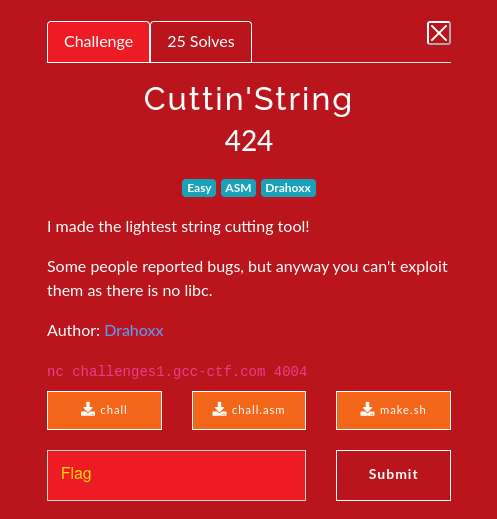

# Cuttin'String 

### Challenge:
##### I made the lightest string cutting tool!
##### Some people reported bugs, but anyway you can't exploit them as there is no libc.
##### Author: Drahoxx
##### Files: [chall](chall), [chall.asm](chall.asm), [make.sh](make.sh)
##### Links: ```nc challenges1.gcc-ctf.com 4004```

### Solution:
As we can choose the size of the cutted string we can basically print out the stack, in particular we want 2 values:
- An address to leak pie
- A stack address to pivot to

Then due to the lack of useful gadgets in the binary (and the lack of a libc) we can use the [SROP technique](https://ir0nstone.gitbook.io/notes/types/stack/syscalls/sigreturn-oriented-programming-srop).

In short we need to write /bin/sh and our sigreturn frame somewhere in memory, then call the sigreturn syscall with our frame in rsp.

We can use the read in the binary + some stack pivoting trickery to write everything we need in our leaked stack address,
lastly we need to set rax to 15 and call a syscall gadget, we can use the read syscall as it sets rax as the number of characters read.

Script (Very badly written): [solve.py](solve.py)

Flag: ```GCC{SR0p_1s_f0r_Sup3r_R0P_Right?}```