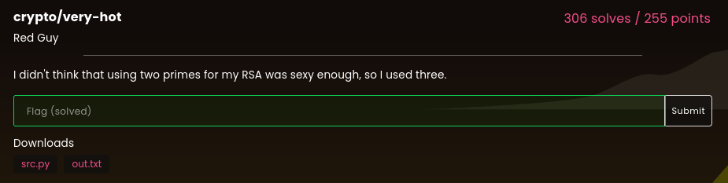
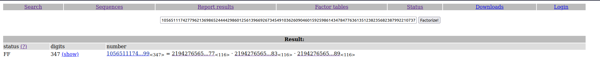

# Very-Hot

### Challenge:
##### I didn't think that using two primes for my RSA was sexy enough, so I used three.
##### Files: [src.py](src.py), [out.txt](out.txt)

### Solution:
Very standard rsa challenge, the prime factors of N are generated using this code:

```py
p = getPrime(384)
while(not isPrime(p + 6) or not isPrime(p + 12)):
    p = getPrime(384)
q = p + 6
r = p + 12

n = p * q * r
```

So we know they are relatively small and close to each other, thankfully we don't have to do any hard work as 
[factordb](https://factordb.com) comes to our aid:



Once we know the prime factors it's just a simple matter of calculating the flag:

```py
from Crypto.Util.number import long_to_bytes, bytes_to_long

n = 10565111742779621369865244442986012561396692673454910362609046015925986143478477636135123823568238799221073736640238782018226118947815621060733362956285282617024125831451239252829020159808921127494956720795643829784184023834660903398677823590748068165468077222708643934113813031996923649853965683973247210221430589980477793099978524923475037870799
ct = 9953835612864168958493881125012168733523409382351354854632430461608351532481509658102591265243759698363517384998445400450605072899351246319609602750009384658165461577933077010367041079697256427873608015844538854795998933587082438951814536702595878846142644494615211280580559681850168231137824062612646010487818329823551577905707110039178482377985
e = 65537

#factordb ftw
p = 21942765653871439764422303472543530148312720769660663866142363370143863717044484440248869144329425486818687730842077
q = 21942765653871439764422303472543530148312720769660663866142363370143863717044484440248869144329425486818687730842083
r = 21942765653871439764422303472543530148312720769660663866142363370143863717044484440248869144329425486818687730842089

phi = (p-1) * (q-1) * (r-1)

d = pow(e,-1,phi)
pt = pow(ct,d,n)

print(long_to_bytes(pt).decode())
#lactf{th4t_w45_n0t_so_53xY}
```

Flag: ```lactf{th4t_w45_n0t_so_53xY}```