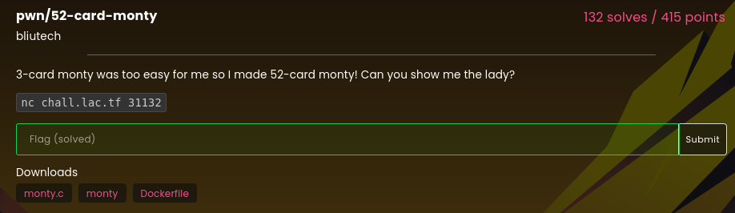

# 52-card-monty

### Challenge:
##### 3-card monty was too easy for me so I made 52-card monty! Can you show me the lady?.
##### Files: [monty.c](monty.c), [monty](monty)

### Solution:
We can notice a bof while adding our name to the leaderboard after completing the game, there's also a win() function in the binary, however we need to somehow leak the stack canary and pie before we can return to it.

The game consists in peeking a card in the deck by choosing an index, the program performs bounds checkings on our indexes, however the deck size constant is 0x52 instead of 52, which is the actual size of the deck. 

Thus we can leak stack values by giving indexes greater than 51, in particular we can leak the canary and an address from the binary, which we can use to calculate the program's base and defeat pie.

After we're finished leaking we can craft our payload and return to win.

Solve script: [solve.py](solve.py)

Flag: ```lactf{m0n7y_533_m0n7y_d0}```