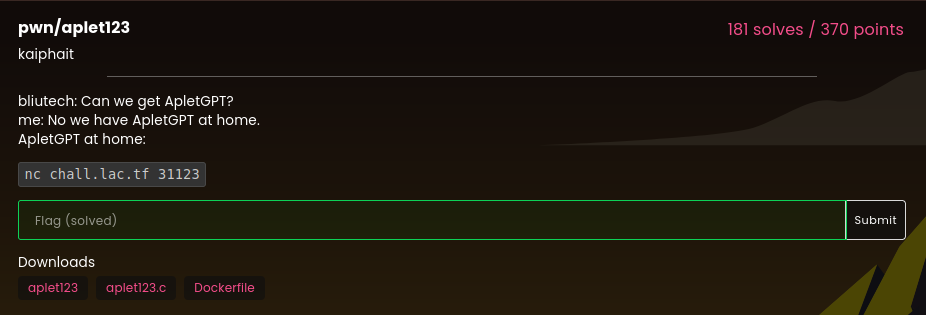

# aplet123

### Challenge:
##### bliutech: Can we get ApletGPT?
##### me: No we have ApletGPT at home.
##### ApletGPT at home:

##### Links: ```nc chall.lac.tf 31123```
##### Files: [aplet123](aplet123), [aplet123.c](aplet.c)

### Solution:
This was a standard ret2win challenge with a need to leak the canary.

```c
gets(input);
    char *s = strstr(input, "i'm");
    if (s) {
      printf("hi %s, i'm aplet123\n", s + 4);
```

We obviously have a bof on the input variable thanks to the gets function, we also notice our input gets printed back to us if it contains the string ```i'm```. 

To check the presence of this substring the challenge uses the function strstr which returns a pointer to the beginning of the substring, so for example if our input was "Hello i'm a person", it would return "i'm a person".

The substring gets printed with its first four characters skipped, however the substring is only 3 characters long, we can abuse this to make printf print beyond the input buffer and leak stack values, for example: the canary.

Knowing this our payload becomes:

```py
b"A"*69+b"i'm"
```

72 characters to fill the buffer stopping right before the null-byte of the canary, strstr() will return a pointer to the trailing substring, printf will then printf that while also skipping 4 characters, ```i'm``` and the null-byte of the canary.

Once we get the canary printed out to us we can return to the win function and get the flag.

Solve script: [solve.py](solve.py)

Flag: ```lactf{so_untrue_ei2p1wfwh9np2gg6}```