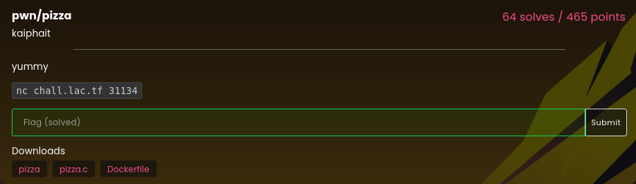

# pizza

### Challenge:
##### yummy.
##### Files: [pizza](pizza), [pizza.c](pizza.c)

### Solution:
There's a format string vulnerability when printing out the custom toppings of a pizza back to the user, giving us an arbitrary read/write primitive.

Firstly we leak the pie by reading an address off the stack, after that we can read an address from the got, leaking the libc.

Lastly we can use the previous leaks to overwrite the got of printf with system, 
turning a ```printf("/bin/sh")``` call into ```system("/bin/sh")```.

Solve script: [solve.py](solve.py)

Flag: ```lactf{golf_balls_taste_great_2tscx63xm3ndvycw}```