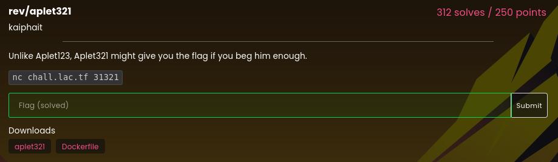

# aplet321

### Challenge:
##### Unlike Aplet123, Aplet321 might give you the flag if you beg him enough.
##### Links: ```nc chall.lac.tf 31321```
##### Files: [aplet321](aplet321)

### Solution:
The challenge had us interacting with a fictitious chatbot named aplet321, by looking at the disassembly of the main function we can see our goal is to make the bot print out the flag by asking it nicely.

```c
  puts("hi, i\'m aplet321. how can i help?");
  fgets(&local_238,0x200,stdin);
  sVar2 = strlen(&local_238);
  if (5 < sVar2) {
    please_counter = 0;
    pretty_counter = 0;
    pcVar3 = &local_238;
    do {
      iVar1 = strncmp(pcVar3,"pretty",6);
      pretty_counter = pretty_counter + (uint)(iVar1 == 0);
      iVar1 = strncmp(pcVar3,"please",6);
      please_counter = please_counter + (uint)(iVar1 == 0);
      pcVar3 = pcVar3 + 1;
    } while (pcVar3 != acStack_237 + ((int)sVar2 - 6));
    if (please_counter != 0) {
      pcVar3 = strstr(&local_238,"flag");
      if (pcVar3 == (char *)0x0) {
        puts("sorry, i didn\'t understand what you mean");
        return 0;
      }
      if ((pretty_counter + please_counter == 0x36) && (pretty_counter - please_counter == -0x18)) {
        puts("ok here\'s your flag");
        system("cat flag.txt");
        return 0;
      }
      puts("sorry, i\'m not allowed to do that");
      return 0;
    }
  }
  puts("so rude");
  return 0;
}
```

The most important things we can discern from this code is that we need the word "flag" to appear at any point in our input while the words "pretty" and "please" need to appear a certain number of times, more specifically we need to satisfy this condition:

```c
((pretty_counter + please_counter == 0x36) && (pretty_counter - please_counter == -0x18))
```

Solving this equation gives us our numbers of pretty pleases which we can use to get the flag:

```py
from pwn import *

r = remote("chall.lac.tf", 31321)

payload = b"pretty"*15+b"please"*39+b"flag"

r.sendline(payload)
r.interactive()
#lactf{next_year_i'll_make_aplet456_hqp3c1a7bip5bmnc}
```

Flag: ```lactf{next_year_i'll_make_aplet456_hqp3c1a7bip5bmnc}```