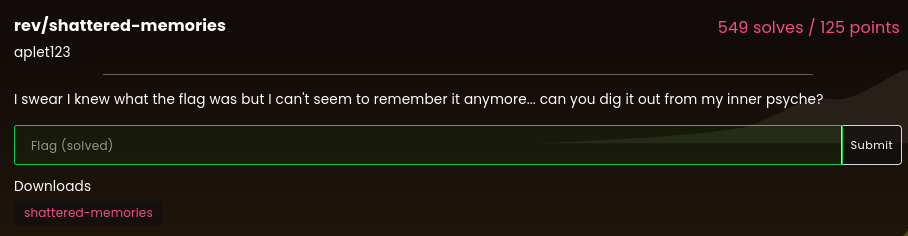

# shattered-memories

### Challenge:
##### I swear I knew what the flag was but I can't seem to remember it anymore... can you dig it out from my inner psyche?.
##### Files: [shattered-memories](shattered-memories)

### Solution:
Run strings on the provided binary and reconstruct the flag:

```bash
$ strings shattered-memories 
What was the flag again?
No, I definitely remember it being a different length...
t_what_f
t_means}
nd_forge
lactf{no
orgive_a
```

Flag: ```lactf{not_what_forgive_and_forget_means}```