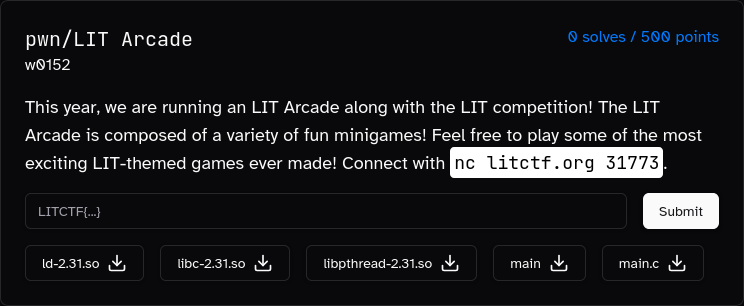

# LIT Arcade

### Description:
#### This year, we are running an LIT Arcade along with the LIT competition! The LIT Arcade is composed of a variety of fun minigames! Feel free to play some of the most exciting LIT-themed games ever made! Connect with `nc litctf.org 31773`.

### Overview:

The challenges presents us with 3 mini-games to play and two options to either check our current score or propose a new mini-game.

```bash
$ ./main
-----------------------------------------------------------
Welcome to LIT Arcade!
-----------------------------------------------------------
1. LITe a fire
2. LITebulb puzzle
3. LIT fuse
8. Check LIT score
9. Propose a LIT Minigame
0. Exit LIT Arcade

> 
```

To solve the challenge we can safely ignore the first two mini-games, even though the 2nd one has an unintended vuln. (We can choose arbitrary indexes for the `toggleRow` and `toggleColumn` functions)

### Getting a leak:

The source code for the challenge was provided so let's take a look at the `considerProposal` function:

```c
long considerProposal(char newMinigame[256]) {
	if (strstr(newMinigame, "LIT") != NULL) {
		return 100;
	}
	else if (strstr(newMinigame, "TIL") == NULL) {
		// no mentioning our rival!
		return 1;
	}
}

char newMinigame[256];


long sendProposal() {
	puts("What is the premise of your minigame?");
	
	newMinigame[read(0, newMinigame, 256) - 1] = 0;
	
	puts("Thank you! We will consider your proposal.");
	
	return considerProposal(newMinigame);
}
```

We can notice how if neither the conditions are met the function will seemingly not return anything, however the actual return value will be whatever is in the rax register at the moment of the function return, and it just so happens that the return value of the last call to `strstr` will be left intact inside rax.

Therefore by sending the string `"TIL"` we can get the address of said string returned to us in the form of our score, we can use that to calculate the base address of the binary. 

```bash
> 9
What is the premise of your minigame?
TIL
Thank you! We will consider your proposal.
-----------------------------------------------------------
1. LITe a fire
2. LITebulb puzzle
3. LIT fuse
8. Check LIT score
9. Propose a LIT Minigame
0. Exit LIT Arcade

> 8
Your LIT score: 109079117336960 #0x6334f60a9180
```

### Vulnerability:

In the third mini-game we can find a race-condition in how the `actualCode` and `code` buffers are handled.

There is a small window after the `timer_function` thread calls `loseFuse` where the two buffers are freed but it's still possible to write in the `code` buffer using the `input_function` thread.

This UAF effectively gives us full control of the next pointer of a freed tcache chunk, giving us an arbitrary write.

```c
void loseFuse(int fromTimer) {
	free(actualCode);
	free(code);
	
	printf("\x1B[3A");
	leftNChars(numChars + 2);
	printf("|  -------  |\x1B[13D\x1B[3B");
	rightNChars(numChars + 2);
	sleep(1);
	
	if (fromTimer) {
		restoreTio();
		pthread_cancel(input_thread);
	}
	
	puts("\n\nBOOM! You died.");
	
	char *name = (char *) malloc(15);
	char *desc = (char *) malloc(15);
	
	printf("\nEnter name for your gravestone: ");
	name[read(0, name, 15) - 1] = 0;
	
	printf("\nEnter text for your gravestone: ");
	desc[read(0, desc, 15) - 1] = 0;
	
	puts  (" ___________________ ");
	puts  ("/                   \\");
	puts  ("|        RIP        |");
	puts  ("|                   |");
	printf("|  %-15s  |\n", name);
	puts  ("|                   |");
	puts  ("|                   |");
	printf("|  %15s  |\n", desc);
	puts  ("|___________________|");
	
	exit(0);
}
```

We will be able to control the address returned by the 2nd `malloc` and write up to 15 bytes into it.

### Solution:

As the binary is partial-relro we can write to the GOT of `exit` and make it point to `main`, giving us more arbitrary writes, however as our input will be null terminated we need to make sure to not mangle the subsequent GOT entries.

We can then target the GOT of `strstr` turning it into `printf` effectively introducing a format string vulnerability in the program, as we can call `strstr` with user input in the `considerProposal` function.

We can then leak the libc using a format string such as `"%3$p"`.

Lastly we can repeat the arbitrary write to change the GOT entry of `strstr` into `system` and call said function with `/bin/sh` as our argument.

#### Solve script: [solve.py](solve.py)

#### Flag: ```LITCTF{0h_why_mu57_7hr34d1ng_b3_50_d1ff1cul7_4ls0_d0_n0t_f0rg37_7o_wr1t3_r37urn_v4lu35_bd5aa3a7}```