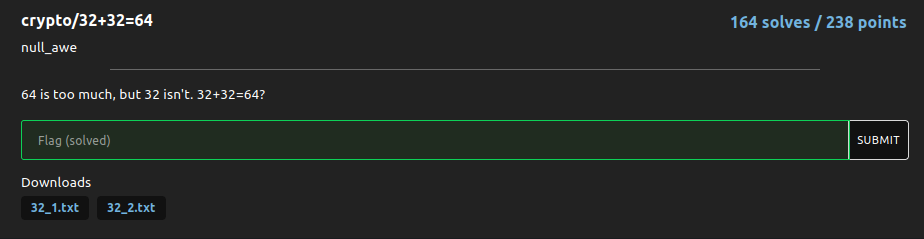

# 32+32=64

### Challenge:
##### 64 is too much, but 32 isn't. 32+32=64?

##### Files: [32_1.txt](32_1.txt),[32_2.txt](32_2.txt)

### Solution:

Concatenate the two files then keep on decoding from base64 (32 times) to get the flag:

Flag: ```nbctf{h0pE_y0U_h4d_fUn}```