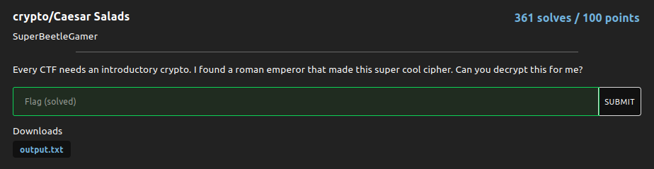

# Caesar Salads

### Challenge:
##### Every CTF needs an introductory crypto. I found a roman emperor that made this super cool cipher. Can you decrypt this for me?.

##### Files: [output.txt](output.txt)

### Solution:

```Ciphertext: xlmdp{ryzo_drsc_gkcxd_dyy_rkbn_yp_k_cdkbd}```

Putting it into a ceaser cipher solver gives us our flag:

Flag: ```nbctf{hope_this_wasnt_too_hard_of_a_start}```