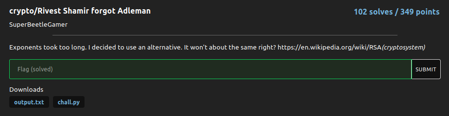

# Rivest Shamir forgot Adleman

### Challenge:
##### Exponents took too long. I decided to use an alternative. It won't about the same right? https://en.wikipedia.org/wiki/RSA(cryptosystem)

##### Files: [output.txt](output.txt),[chall.py](chall.py)

### Solution:

The challenge script seems to be a standard implementation of rsa, however it uses a xor operation instead of exponentiation, we don't care about the modulo as the xor-ed ciphertext is too small.
Knowing this we can decipher c by xor-ing it with e:

```py
>>> from Crypto.Util.number import long_to_bytes
>>> e =  123589168751396275896312856328164328381265978316578963271231567137825613822284638216416
>>> ct =  159269674251793083518243077048685663852794473778188330996147339166703385101217832722333
>>> print(long_to_bytes(ct^e))
b'nbctf{wh0_t0ld_m3_t0_u53_xors!?!?!?}'
```

Flag: ```nbctf{wh0_t0ld_m3_t0_u53_xors!?!?!?}```