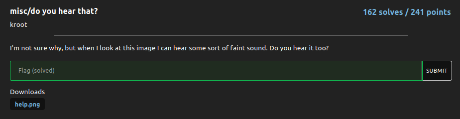
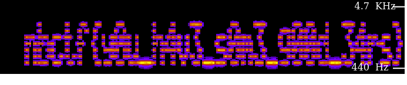

# do you hear that?

### Challenge:
##### I'm not sure why, but when I look at this image I can hear some sort of faint sound. Do you hear it too?

##### Files: [help.png](help.png)

### Solution:


Running foremost on the png gives us a hidden .wav file, which is a 4 second clip of seemingly random frequencies.
Running the .wav thru an online spectrum analyzer such as [https://academo.org/demos/spectrum-analyzer/](https://academo.org/demos/spectrum-analyzer/) gives us our flag:



Flag: ```nbctf{y0u_h4v3_s0m3_g00d_34rs}```