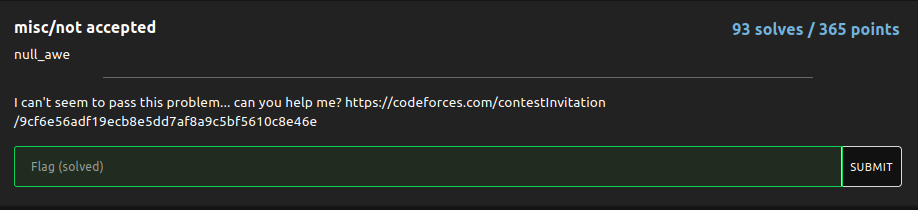
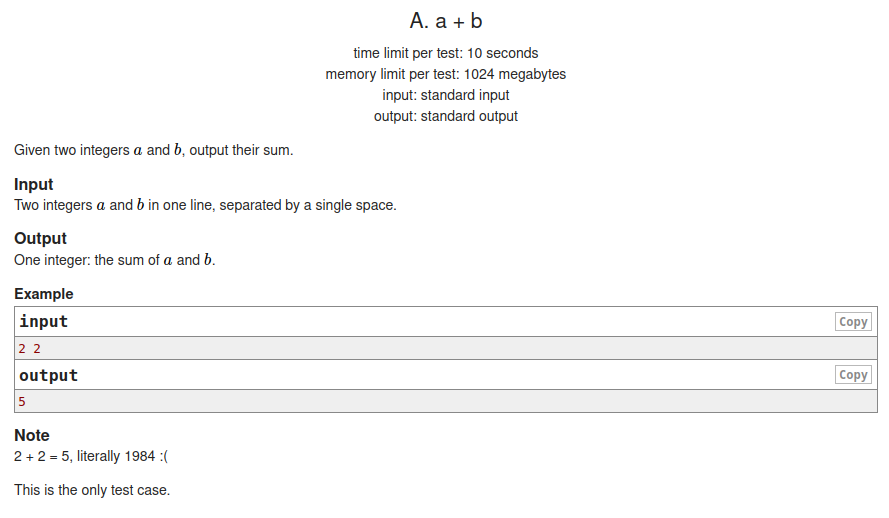
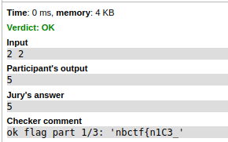
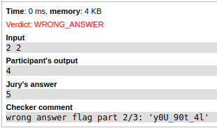
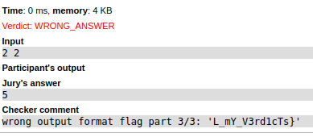

# not accepted

### Challenge:
##### I can't seem to pass this problem... can you help me?

##### Links: [https://codeforces.com/contestInvitation/9cf6e56adf19ecb8e5dd7af8a9c5bf5610c8e46e](https://codeforces.com/contestInvitation/9cf6e56adf19ecb8e5dd7af8a9c5bf5610c8e46e)

### Solution:

Following the link brings us to a codeforces contest with this problem:



To get the flag we need to get ac, wa and output no answer.







Flag: ```nbctf{n1C3_y0U_90t_4lL_mY_V3rd1cTs}```