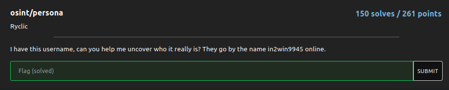
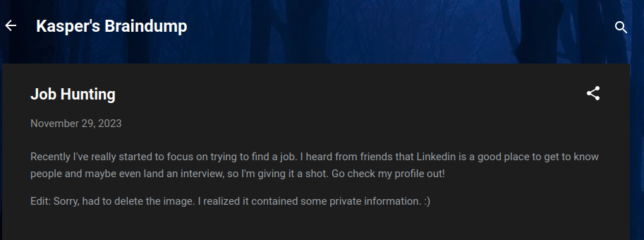
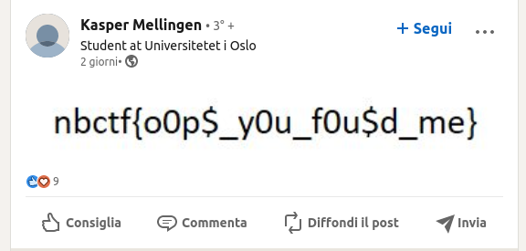

# persona

### Challenge:
##### I have this username, can you help me uncover who it really is? They go by the name in2win9945 online.

### Solution:

Running sherlock on the given username:

```bash
$ python3 sherlock.py in2win9945
[*] Checking username in2win9945 on:

[+] Contently: https://in2win9945.contently.com/
[+] G2G: https://www.g2g.com/in2win9945
[+] Lolchess: https://lolchess.gg/profile/na/in2win9945
[+] Monkeytype: https://monkeytype.com/profile/in2win9945
[+] Reddit: https://www.reddit.com/user/in2win9945
[+] TikTok: https://tiktok.com/@in2win9945
[+] Twitter: https://twitter.com/in2win9945
[+] Typeracer: https://data.typeracer.com/pit/profile?user=in2win9945
[+] Virgool: https://virgool.io/@in2win9945
[+] Whonix Forum: https://forums.whonix.org/u/in2win9945/summary
[+] ebio.gg: https://ebio.gg/in2win9945
[+] metacritic: https://www.metacritic.com/user/in2win9945

[*] Search completed with 12 results
```

Filtering out the false positives we can find his [monkeytype account](https://monkeytype.com/profile/in2win9945), on his account we can find a link to his [speedtyping blog](https://in2wintyping.blogspot.com/), and by going to his [blogger account](https://www.blogger.com/profile/13087769951373300782) we can find his other [blog](https://kaspermellingencs.blogspot.com/), where we see a suspicious post:



Using the wayback machine we can recover the [post](https://web.archive.org/web/20231130062319/https://kaspermellingencs.blogspot.com/2023/11/job-hunting.html)

[!challenge2](challenge2.png)

We can now go to his [linkedin account](https://www.linkedin.com/in/kasper-mellingen-9b48202a2/) and claim our flag:



Flag: ```nbctf{o0p$_y0u_f0u$d_me}```