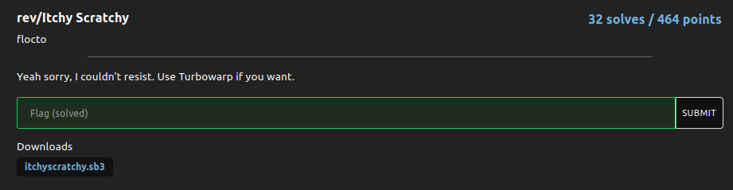

# Itchy Scratchy

### Challenge:
##### Yeah sorry, I couldn't resist. Use Turbowarp if you want.

##### Files: [itchyscratchy.sb3](itchyscratchy.sb3)

### Solution:

Use [turbowrap](https://turbowarp.org) to "decompile" the project, it asks for a name that needs to be equal to ```isaac newton``` then aks for the flag.
Firstly we extract the variables from the project

```py
alpha = ["@", "z","v","t","w","r","c","a","5","7","n","4","9","u","2","b","y","1","j","d","q","o","6","g","0","k","s","x","f","i","8","p","e","l","m","h","3"]
enc = [-1, 902,764,141,454,207,51,532,1013,496,181,562,342]
name = [-1, 29, 26, 7, 7, 6, 0, 10, 32, 4, 3, 21, 10]
```

I use @ and -1 as placeholders since Scratch is 1-based.

```py
k=1
while k<=12:
    i=1
    j=1
    while i<=12:
        j = (i*i+name[i])%12+1
       
        #enc[i] -= name[i]*name[j]
        tmp = input[i]*input[j] + name[i]*name[j]

        if tmp != enc[i]:
            exit(0)

        i+=1
    break

print("ok")
```

I rewrote the flag checking function in python for more clarity, basically it checks if the flag starts with ```nbctf{``` and ends with ```}```, then it checks the 12 remaining characters.

```py
input = []
alpha2 = {}

for o, i in enumerate(alpha):
    alpha2[i]=o

flag = "nbctf{12lett3rf149}"
answer = "@12lett3rf149"

for i in answer:
    input.append(alpha2[i])
```

Our input gets transformed using the alpha list as seen by the above code.

So basically tmp needs to be equal to enc[i], and tmp is created from our input:

```py
enc[i] -= name[i]*name[j] #we know name from the start so it's non-consequential
tmp = input[i]*input[j] + name[i]*name[j]
```

However the enc[i] is created by multiplying two letter pairs, how can find the original letters?

```py
''' i j pairs
1 7
2 7
3 5
4 12
5 8
6 1
7 12
8 1
9 2
10 8
11 11
12 11'''
```

If we check how the pairs are generated we can see the 11th letter is created by multiplying itself, so we can find the original value by root squaring it.
Knowing the 11th letter we can now calculate the 12th letter and so on.

Once we're done we can revert the alpha transformation to get our flag:

Solve script: [rev.py](rev.py)

Flag: ```nbctf{12lett3rf149}```