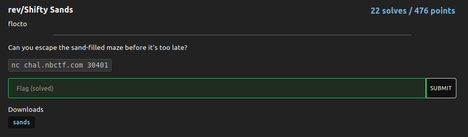

# Shifty Sands

### Challenge:
##### Can you escape the sand-filled maze before it's too late?

##### Files: [sands](sands)
##### Links: ```nc chal.nbctf.com 30401```

### Solution:

Basically it was a blind labyrinth, if u get to the end u get the flag, however u need to avoid the sand in the labyrinth, which moves around whenever u move.
Once u reverse how the sand move and the structure of the labyrinth it's just a matter of getting to the goal while avoiding the sands.

Solve script: [rev.py](rev.py)

Flag: ```nbctf{5lowly_5huffl3d_5wa110wing_54nd5}```