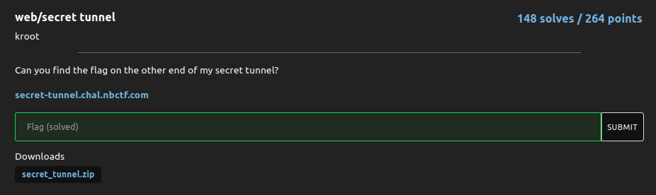
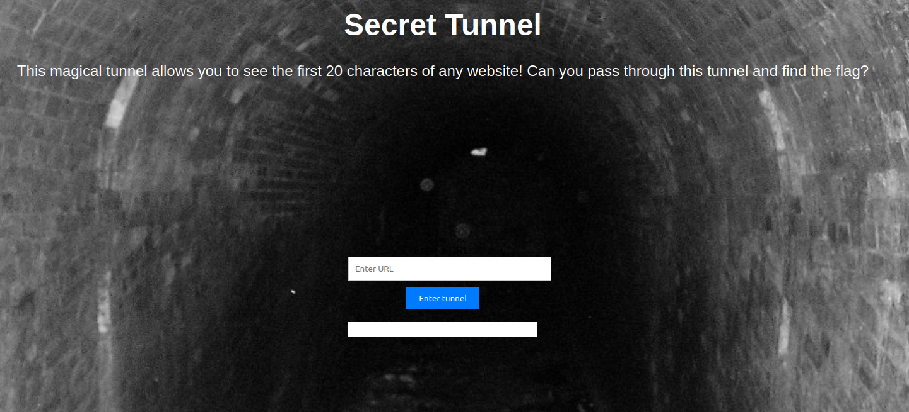
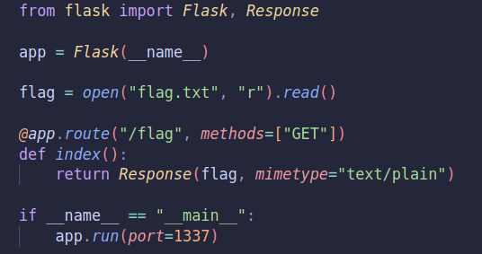
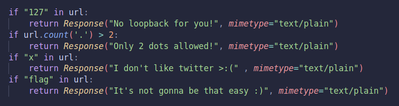
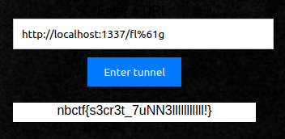

# secret tunnel

### Challenge:
##### Can you find the flag on the other end of my secret tunnel?

##### Links: [https://secret-tunnel.chal.nbctf.com](https://secret-tunnel.chal.nbctf.com)
##### Files: [secret_tunnel.zip](secret_tunnel.zip)

### Solution:



Looking at the website source code we can see that the flag is at /flag on port 1337:



So now we know what url we need to input into the website, however we have some restraints to bypass:



A standard payload would be ```http://localhost:1337/flag``` however we cant use "flag" in there, we can just percent encode a letter bypass the check:

```
http://localhost:1337/fl%61g
```



Flag: ```nbctf{s3cr3t_7uNN3lllllllllll!}```