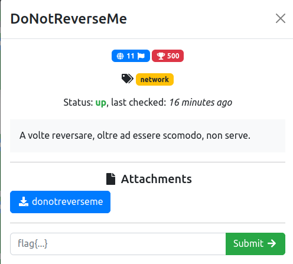
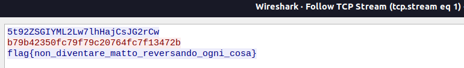

# DoNotReverseMe

### Challenge:
##### A volte reversare, oltre ad essere scomodo, non serve.

##### Files: [donotreverseme](donotreverseme)

### Solution:
Runnando strings sul binario si possono notare molto riferimenti a socket e simili:
```bash
Address not available
Network is down
Network unreachable
Connection reset by network
Connection aborted
No buffer space available
Socket is connected
Socket not connected
```
Questo, oltre al fatto che fosse una challenge di network, mi ha portato ad analizzare i pachetti di rete in uscita dopo avere eseguito il binario.



Flag: ```flag{non_diventare_matto_reversando_ogni_cosa}```
