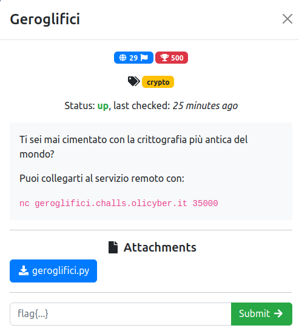

# Geroglifici

### Challenge:
##### Ti sei mai cimentato con la crittografia più antica del mondo?

##### Puoi collegarti al servizio remoto con:
##### ```nc geroglifici.challs.olicyber.it 35000```

##### Files: [geroglifici.py](geroglifici.py)

### Solution:
La challenge ci fornisce la flag "cryptata" con delle emoji, ad ogni emoji corrisponde una lettera ed abbiamo la possibilità di cryptare un testo a nostro piacimento. Sapendo questo basta cryptare ogni possibile lettera o simbolo che la flag potrebbe contenere.

Script: [solve.py](solve.py)

Flag: ```flag{anche_gli_egizi_conoscevano_Cesare}```
