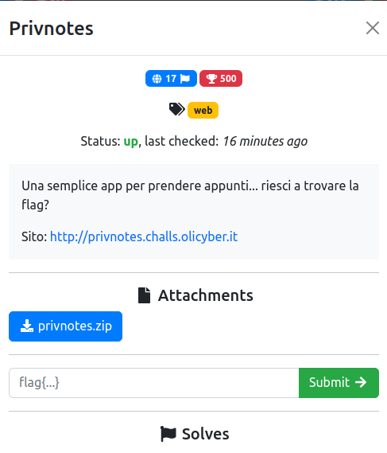
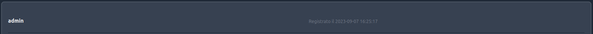
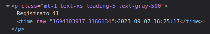
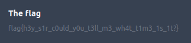

# Privnotes

### Challenge:
##### Una semplice app per prendere appunti... riesci a trovare la flag?

##### Links: [http://privnotes.challs.olicyber.it](http://privnotes.challs.olicyber.it)
##### Files: [privnotes.zip](privnotes.zip)

### Solution:
La challenge ci fornisce un sito in cui è possibile registrare un account e postare note. Osservando il source code è possibile notare come la flag sia in un post nell'account dell'admin, inoltre le password degli account vengono generate in base alla data in cui viene effettuata la registrazione.

```py
regdate = time.time()
random.seed(regdate)
password = "".join(random.choices(string.ascii_letters + string.digits, k=16))
```

Sul sito è presente una pagina che mostra la data di registrazione dell'admin.



Tuttavia questo non basta, poiché time.time() restituisce l'unix time con una parte decimale.



Fortunatamente, ispezionando l'html è possbile trovare il valore corretto.

Sapendo il tempo in cui si è registrato l'admin è possibile generare la sua password:

```py
>>> random.seed(1694103917.3166134)
>>> password = "".join(random.choices(string.ascii_letters + string.digits, k=16))
>>> print(password)
t2rxkRl4A6rBxzaE
```



Flag: ```flag{h3y_s1r_c0uld_y0u_t3ll_m3_wh4t_t1m3_1s_1t?}```

