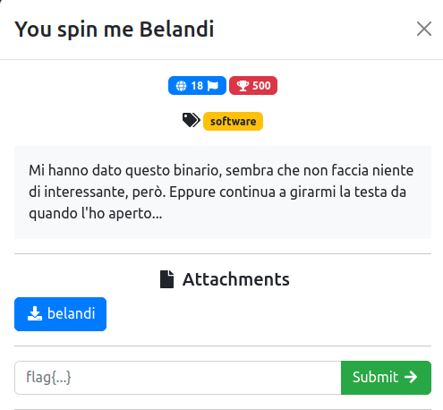
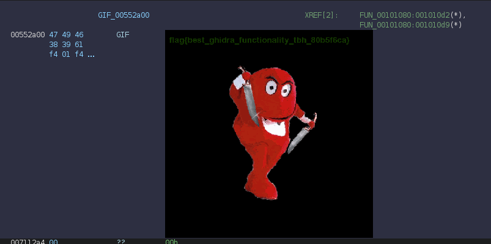

# You spin me Belandi

### Challenge:
##### Mi hanno dato questo binario, sembra che non faccia niente di interessante, però. Eppure continua a girarmi la testa da quando l'ho aperto...
##### Files: [belandi](belandi)

### Solution:
Nel binario è presente una gif, la quale contiene la flag in uno dei suoi frame.



Flag: ```flag{best_ghidra_functionality_tbh_80b5f6ca}```
