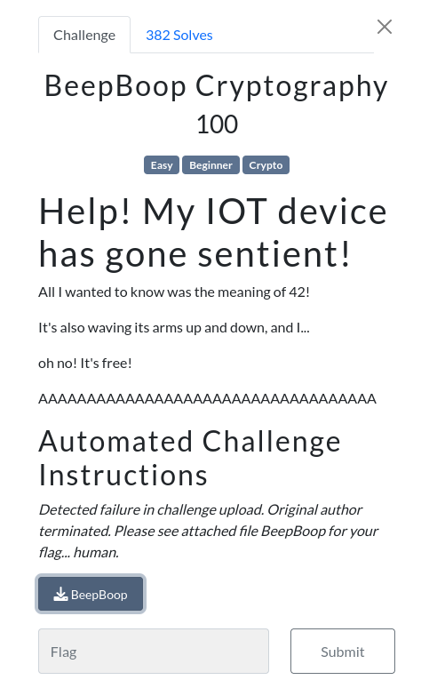

# BeepBoop Cryptography 

### Challenge:
##### Help! My IOT device has gone sentient!
##### All I wanted to know was the meaning of 42!
##### It's also waving its arms up and down, and I...
##### oh no! It's free!
##### AAAAAAAAAAAAAAAAAAAAAAAAAAAAAAAAAAA
##### Automated Challenge Instructions
##### Detected failure in challenge upload. Original author terminated. Please see attached file BeepBoop for your flag... human.
##### Files: [BeepBoop](BeepBoop)

### Solution:
The challenge gives us a txt file with this text:

```
beep beep beep beep boop beep boop beep beep boop boop beep beep boop boop beep beep boop boop beep boop beep beep beep beep boop boop beep beep beep beep boop beep boop boop boop boop beep boop boop beep boop boop boop beep beep boop beep beep boop boop beep boop beep boop boop beep boop boop beep beep boop boop boop beep boop boop boop beep beep boop beep beep boop boop beep beep boop beep boop beep boop boop boop boop beep boop beep beep boop boop boop beep boop boop beep beep boop boop beep beep beep beep boop beep boop boop beep boop boop boop beep beep boop boop beep beep boop boop boop beep boop boop boop beep beep boop beep beep beep boop beep boop boop beep boop beep boop boop boop beep beep boop beep beep boop boop beep boop beep boop boop beep boop boop beep beep boop boop boop beep boop boop boop beep beep boop beep beep boop boop beep beep boop beep boop beep boop boop boop boop beep boop beep beep boop boop boop beep boop boop beep beep boop boop beep beep beep beep boop beep boop boop beep boop boop boop beep beep boop boop beep beep boop boop boop beep boop boop boop beep beep boop beep beep beep boop beep boop boop beep boop beep boop boop boop beep beep boop beep beep boop boop beep boop beep boop boop beep boop boop beep beep boop boop boop beep boop boop boop beep beep boop beep beep boop boop beep beep boop beep boop beep boop boop boop boop beep boop beep beep boop boop boop beep boop boop beep beep boop boop beep beep beep beep boop beep boop boop beep boop boop boop beep beep boop boop beep beep boop boop boop beep boop boop boop beep beep boop beep beep boop boop boop boop boop beep boop
```

Mapping the beep and boops to 0 and 1 respectively gives us this binary string:
```
0000101001100110011010000110000101111011011100100110101101100111011100100110010101111010011101100110000101101110011001110111001000101101011100100110101101100111011100100110010101111010011101100110000101101110011001110111001000101101011100100110101101100111011100100110010101111010011101100110000101101110011001110111001001111101
```

Which when translated to text gives us:
```
fha{rkgrezvangr-rkgrezvangr-rkgrezvangr}
```

Using an online ceaser cipher solver gives us the flag:

Flag: ```sun{exterminate-exterminate-exterminate}```