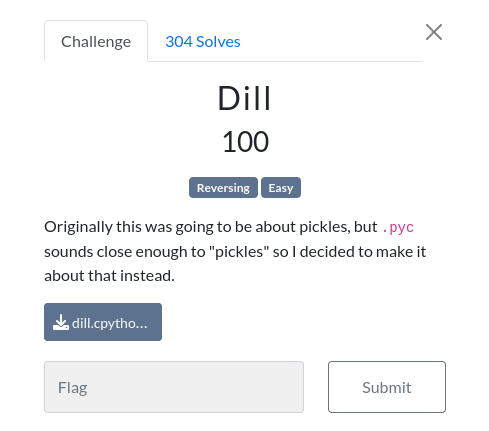

# Dill

### Challenge:
##### Originally this was going to be about pickles, but .pyc sounds close enough to "pickles" so I decided to make it about that instead.

##### Files: [dill.cpython-38.pyc](dill.cpython-38.pyc)

### Solution:
Decompiling the .pyc gives us:
```py 
class Dill:
    prefix = 'sun{'
    suffix = '}'
    o = [5, 1, 3, 4, 7, 2, 6, 0]

    def __init__(self) -> None:
        self.encrypted = 'bGVnbGxpaGVwaWNrdD8Ka2V0ZXRpZGls'

    def validate(self, value: str) -> bool:
        if not (value.startswith(Dill.prefix) and value.endswith(Dill.suffix)):
            return False
        value = value[len(Dill.prefix):-len(Dill.suffix)]
        if len(value) != 32:
            return False
        c = [value[i:i + 4] for i in range(0, len(value), 4)]
        value = ''.join([c[i] for i in Dill.o])
        if value != self.encrypted:
            return False
        else:
            return True
```

Basically, it checks if the input starts and ends with ```"sun{"``` and ```"}"```, then it strips them from the string, the remaining string needs to be 32 chars long and be equal to ```bGVnbGxpaGVwaWNrdD8Ka2V0ZXRpZGls``` after a series of operations.

Firstly it divides the string into a list of 4 chars per element, then it shuffles them around according to the ```o = [5, 1, 3, 4, 7, 2, 6, 0]``` order, so the 0th elements becomes the 7th and so on.
Putting them in the right order gives us our flag:

Flag: ```sun{ZGlsbGxpa2V0aGVwaWNrbGVnZXRpdD8K}```