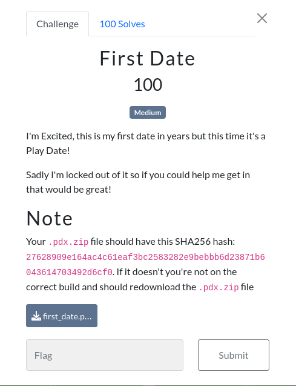

# First Date 

### Challenge:
##### I'm Excited, this is my first date in years but this time it's a Play Date!
##### Sadly I'm locked out of it so if you could help me get in that would be great!

##### Note:
##### Your .pdx.zip file should have this SHA256 hash: ```27628909e164ac4c61eaf3bc2583282e9bebbb6d23871b6043614703492d6cf0```. If it doesn't you're not on the correct build and should redownload the .pdx.zip file

##### Files: [first_date.pdx.zip](first_date.pdx.zip)

### Solution:
The challenge gives a zip file which contains the files [main.pdz](main.pdz) and [pdxinfo](pdxinfo).
Searching around the internet we can find out that the .pdz file is a format used in the [game console Playdate](https://en.wikipedia.org/wiki/Playdate_(console)).
More specifcally we can find [https://github.com/cranksters/playdate-reverse-engineering](https://github.com/cranksters/playdate-reverse-engineering), which gives us a [tool](https://github.com/cranksters/playdate-reverse-engineering/blob/main/tools/pdz.py) to unpack the .pdz file.

Using the tool we manage to get the Lua bytecode, which we can decompile using [another tool found in the repo](https://github.com/scratchminer/unluac), giving us finally [main.lua](main.lua).

In this file the important functions are generateOrder() and clean(), by giving the output of generateOrder() to clean() and enclosing the result in sun{} we can get our flag:

Flag: ```sun{MIEANBLVFPZJTDOA}```

Solver: [solve.lua](solve.lua)
