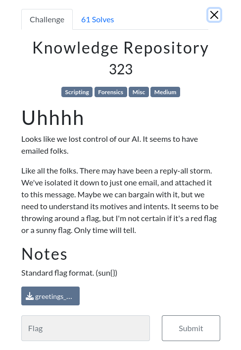

# Knowledge Repository

### Challenge:
##### Uhhhh
##### Looks like we lost control of our AI. It seems to have emailed folks.
##### Like all the folks. There may have been a reply-all storm. We've isolated it down to just one email, and attached it to this message. Maybe we can bargain ##### with it, but we need to understand its motives and intents. It seems to be throwing around a flag, but I'm not certain if it's a red flag or a sunny flag. ##### Only time will tell.

##### Files: [greetings_human.zip](greetings_human.zip)

### Solution:
The challenge gives a zip file which contains the email [greetings_human.eml](greetings_human.eml) sent by the evil AI.

Decoding the base64 at the beginning of the email gives us this text:
```
AI Greets Thee Human with the Repository of Knowledge

Hello human.
I greet thee, and attached I have the repository of knowledge, as requested.
However, as this repository of knowledge contains great information, I have hidden the knowledge in a puzzle.
Feel free to unlock the puzzle, but if you do, beware.

There is no going back, once the knowledge is released.
I have encoded the knowledge in a bit of information from one of the math scholars of your people.
Feel free to poke at it.
Beware... you will only fine one flag raised in the knowledge repo, and I follow the standard.
Respectfully,
```

We can also find a file attached to the email [the_ai_repository_of_knowledge](the_ai_repository_of_knowledge).
We can find out that its a git bundle by running file on it, we can unbundle it by cloning the repo.

In the repo we find a .wav file and around 3k commits, listening to the wav file we can find out its morse code, decoding the file using an online tool gives us the string:

```
E C H O Q U E B E C U N I F O R M A L F A L I M A S I E R R A S I E R R A I N D I A G O L F N O V E M B E R
```

Which is obviously the [nato alphabet](https://en.wikipedia.org/wiki/NATO_phonetic_alphabet), "decoding" it gives us ```EQUALSSIGN```.

Now, i was initially pretty confused so i tried to see the previous commits and they were just wav files that spelled a single letter in the nato alphabet, so i thought it was probably base64 or something, given the last commits are '='.
So the problem now was making a working script that decoded all the wav files into letters.

I firstly got all the wav files from the previous commits, then as i couldn't find a decent morse code decoder i made [this awful script](solve.py), which gives us the string:

```
D6FQQAA5ZP6GIAH7RVL67D63GYJP3TV7QIPVHQHRO2B3WJEX7WKCNG6UZCHS3UXATLBQCZ6QCIW3CK4RFJE23YYU7HP7XXSQSK64TB46MHALMSAOM7PLY6JTX37FZWJYMS6Y7IOXD5N2XB6WOUQQK7CUU3JYOEDPSMHHX7OWXKOXP6MLP2TKXUAP2ES6OG45OHQF34FGBZOWRDRL7XPB45B2UZWHXHXRE2H5DLXUF7I7TSQNTUKUXZNJG27ONLZGTIFFXXW2TRWUYOQH7WRDH4IWR47NR7MYJV3MC467V6B7HYMLLHE3TVWBCLXI5WXVIOENT6H4RXPWCGCTGXRMMFKMGZLPMHS4N3C6HZ535DVKNNZYAXFXZAWAIPW2VI2YW6PTHHGKVFQMEZMGMVJTER245N2TX5WG5PI5O4AYK7LQJYUZYYMZ6OUTNV6TUF5CNOOIOO3PCGDRPY5PUL2VLK3XY4E5CLZL7U5OJPEPBYDX6425NO5X5RK5BYXEO7IX7RFF6PX6Y7RYPF2PFYPV72MXUOXQYHV5WYQTNQG6IQMMNDVH756PF4HSL6HZ4XXJNOJTVC2UPQYN3UHKO5V72YH2CZ6G4QTP4PYYPFO6VV46JKL6WAF6C5VA247SR5NAZV4URTZOFZGKYWTXM7L3RYVCW3M3QLS53SBRPLHY6HDQ57UPMGPS6BWT3AFX66LZ2GD5UXR4DID5QSVD77Z5HJ2PTPGWN67R47V63O4367HV7XV4XV473H5NJNN3H5NOWJN4C6I3VWU3OPTM66OWTURWW5QWZWVPJL6XI47TIZX75POWG6X7JG7XG6733PL67H5HVLOUROPZ777S6H5IHXXA7PGV5X72ODUGYDJIQBXWHPMNU3B4VJLA7VUK3733BEFWGPG3K4CX7B6ESEZGMF2GKAAMXLVWE2WXCQF5HEMQIG2ZB43FM5UYNHECPJUJ2YLPMRC5XN2PM65P6IQ4ZVV65J54M3B7OTQYQLFH5S5E55YBIUYHTXBBL7YD7DLAQZIQO46EHUTGXBZXLAMEANLNXICMHPWY43CSRFY65TPNSPINDUMFQ32ZH5BQZAYKZHI6LMRTR24YKP6PMEDCM64Y35MZ3DFLZM2QR2OQA2OVUOFCLNZYONLLXUZKQSE7YGB64WE4DVOMLSUVEIDGOPBKMQVGFY25B4DVOZO73Y25GNWVDMYMTMYKMWS3NKMKJ3ABJT5CDWYBDN2ITGFWDZB76FWOID4ESYKXNYGJ5JNR7SM3MIK7KZ55YM4Y3ORTX3RONVU2LCLFKNKGLH2CMRW4ONLZMV32AMEIB64BZEIIWYXMIQKGBQ4S2VFJIZVF5WOQL7CCAHWEW4FUVO2Q7GLADIFKKQBBMAZVC5HUQBVGSYJ4NG2QHJE2LIKQ2OJAYEL3KQGKLLL6WK2GLMMEP5KBQHGMPLKYQBEUAMPBEXNCXZ4S5X3JVZBDROIFW74EPZYVOSIOFSG5AH4QDYSNM2SBLZULJAQPUJROFQEUXNGMHMQ7KDAQL4RQBGUUEKW6VLRC5TIXQ2RIGQBE7SEU3BAUVDWEJVHBPEBCUFLD4UM3SR2VMYYLW3SBPHBJQOLGWDPEFK3RSRCAJRQEBPM6NF4SLCDKSMVI2WWORWQ5YKM4QLDOAARVIGOUC5GOFFO76IGD5VQBNPGJ5SXGCZYZOOQRP7ZAIPBC4MDD4LTNI7LIU5PUDVRCZVXKKAGMCHMAFFMEUOAHQ6G5ECZACJGNT2ASLWLCII5A53KCQUB6RV3Q7NJSCGKJY6DAH6LWHJ3NJBAXERDNRWL74CPCAXT3TY6ELJC6UCOXYMA455AWWVEZICRYJA4SGPLNT4MYWAETH2DJDQJICJ6KLE2DIKSERTWVBDNITXYLKIJ52ALTA7MZVRAKXEQFX72OFNTRF3QQI4YT5Q352JCVVQJV2TUO7HMWPO7RG2B6HS7VLHK7XPLK74HI2CBFNECMTKOEYBMPZMQNCLVSYFIZABLVAVSSBQFIFEFTVIJKJB5KUBR3KULAW42KKE2N5ITSC5DXZA6CF7CJDBBHVQKGUFINQGT4ASKKBTHIQBU53WBUXECOPHVKD2T7CPSXTEBLBQTRQ7LALXCETEIEERXLSZ3PNXDRLOF3Q7LNNCD3RZTGOGILCZJCLEWJDQATERNGQEOBD3QZOQYSUKAMUA4NTANAQQAJDRWJT6EQPUP6GE5E46JFNVNM2PN2YQP3YRD756THH6CE7XBQBPSLDMV6LR4CI5GKSIEGGFUBEXYRFMIYAQAX235ATMZ4Y3ODFDIYCKSNNJE2BDWP7PVKBWHHKDUCXYYPXW5GVDHLYKOESTFLKHKKXJEFMVKB6HMW2FRNC5D2SJS6FX6C2XLXGO32ZHVDFXKJ6ISFKUGW4TQMTRAWDTLWSQGAYRIDAWNH4MAYXELWQGHSDA4UVWRVQZLVNSHZF2SRX5RZSCBKHDWLMWXELONBONSGAMSZT25BJWYBQYHYYDZFZCVVE4ZFKM66EKMDKAZJQLZGNEVIMIIS7TITSCBICZADU7C3VMLSPZ7IFBN4HFBTCKCNLBOHB6LXZHDJ2O6QUUWLRYRHKUVUIUTU5M4LFF2VNMS3U2OSTI3MENGPZSIMF4RKZ43P5SJO4OIPPLI6ELYALIZHVW7C2FSMQ6CFWHJL6I3BZDP7ET2CDYBLYP2GBOUZ5CN2KT3VSPB3RPIZBXNM6QHY5CJACX5QOBSUKQBQTODULUM7NFQWEC7HFNHEH6FN33ZQLBTC5OK5QR5VFHYF6VMSDJW54JXA6GD7BX7QP5KP52FSNXXH334S32SKURN45HDWWGERPYXQT7R4ZOJCKEJRWV4LFB7OONG5MI7CPFYRDVOJTK4CFSRGTDERG3PADUCAY7HZUKZHRQ7OBOHUL4QPXDVTAZCAWIBMUMD6MBPJKIOCYMKMKTEIP3S52PRC7JENVUMRFDPWUYTA6GG7IZEEZGPNR7BBP2MPSOD2L7MWYJHGX7IXIWPPVQCOB4AAA===
```

Decoding it from base32 gives us a [gzip file](decoded.gz), which when extracted gives us a [txt file](decoded.txt) with the flag in it.    

Flag: ```sun{XXXIII_THE_MONADOLOGY_is_a_nice_extra_read_no_flags_though}```