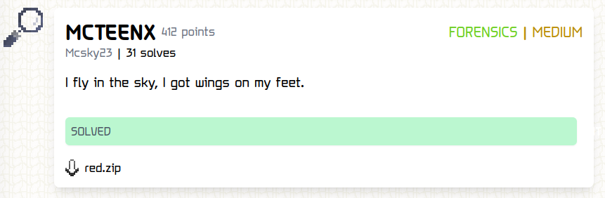
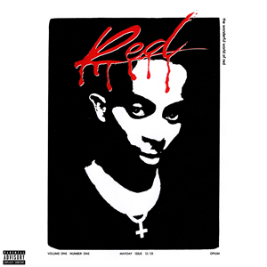
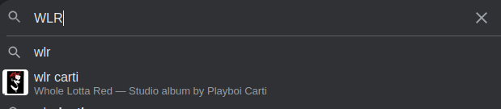

# MCTEENX


## I hope you like Playboi Carti because you're going to see a lot of him.

### Challenge:
##### I fly in the sky, I got wings on my feet.
##### Files: [red.zip](red.zip)
### TLRD:
Known plaintext attack on the zip using the "#!/bin/bash" of the bash script, bash script creates a png, zsteg on png to find the string ```030a111418142c783b39380d397c0d25293324231c66220d367d3c23133c6713343e343b3931```, decode to bytes then xor it with the flag prefix ```TFCCTF{``` giving us the key ```WLR```,
lastly xor the ciphertext with the key to get the flag ```TFCCTF{4int_n0_reasoN1n_a1nt_n0_fixin}```


### Solution:

So we only have a password protected zip file which contains a bash script. The challenge name was "TEENX", and the description "I fly in the sky, I got wings on my feet" (lyrics).
After a quick google search these two elements appeared to be related to Playboi Carti, a musician. As a result, i had two main approaches: attempting to crack the password and investigating any potential connections to Playboi Carti that could serve as the zip's password.

Thankfully a hint from the author of the challenge saved me from trying every variation of "Playboi_Carti" as the password and melting my pc with John the Ripper.


With bruteforcing and guessing the password now off the table i started googling about ctf challenges involving zips and found [this](https://hackmd.io/@malwarepeter/mess_upWriteUp-cyberTalents). 
Shortly put we can crack the zip if we know part of the plaintext, more specifically we need a minimum of 12 bytes of plaintext with [the specific tool i was using](https://github.com/kimci86/bkcrack).
Thankfully we can use ```#!/bin/bash``` followed by a newline as our plaintext which just so happens to be 12 bytes, how convenient huh?
```bash
$ ./bkcrack -C red.zip -c script.sh -p plain.txt
bkcrack 1.5.0 - 2022-07-07
[20:20:37] Z reduction using 6 bytes of known plaintext
[20:20:37] Attack on 1218664 Z values at index 6
bkcrack 1.5.0 - 2022-07-07                                                                                                                                                                                      
88.7 % (1081137 / 1218664)                                                                                                                                                                                      
100.0 % (5 / 5)
[20:52:40] Keys                                                                                                                                                                                                 
c0b1bc78 c3206dfc e7e5bae1   
```
After waiting a while (courtesy of my potato cpu) we can use the keys to get our bash script.
```bash
$ ./bkcrack -C red.zip -c script.sh -k c0b1bc78 c3206dfc e7e5bae1 -d script.sh
bkcrack 1.5.0 - 2022-07-07
[21:04:28] Writing deciphered data script.sh (maybe compressed)
Wrote deciphered data.
```
Here it is !
When ran the script will generate a png image of our old friend Carti.



This is where the steganography part of the challenge begins, thankfully it isn't too complicated.
Simply by running zsteg on the image we can immediately notice something suspicious:
```bash
$ zsteg red.png
b1,r,lsb,xy         .. text: "BGwFnCo#fFbfbcc"
b1,b,lsb,xy         .. file: OpenPGP Public Key
b1,rgb,lsb,xy       .. text: "030a111418142c783b39380d397c0d25293324231c66220d367d3c23133c6713343e343b3931"
```
Trying to decode the string ```030a111418142c783b39380d397c0d25293324231c66220d367d3c23133c6713343e343b3931``` from hex gives a garbage output however i was 99% sure it was related to the flag. After multiple failed ideas, i tried to xor it with the flag prefix ```TFCCTF{``` which gave me this:
```python
>>> from pwn import xor
>>> xor(bytes.fromhex("030a111418142c783b39380d397c0d25293324231c66220d367d3c23133c6713343e343b3931"),"TFCCTF{".encode())
b'WLRWLRW,}z{Y\x7f\x07Ycjppeg2dNu)zXGz$P`xOo\x7fr'
```
Looking at the result i noticed ```WLR``` seemed to be repeating so i tried xoring the ciphertext with it:
```python
>>> xor(bytes.fromhex("030a111418142c783b39380d397c0d25293324231c66220d367d3c23133c6713343e343b3931"),"WLR".encode())
b'TFCCTF{4int_n0_reasoN1n_a1nt_n0_fixin}'
```
Nice! We got our flag ```TFCCTF{4int_n0_reasoN1n_a1nt_n0_fixin}```!

However if you're like me you might be wondering as to why the author chose ```WLR``` as the xor key, a quick google search gives me this:


So i guess my first hunch about the password wasn't totally wrong :P


