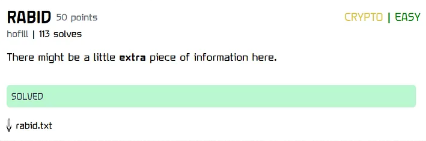
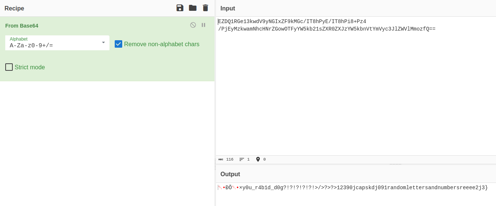

# RABID

### Challenge:
##### There might be a little extra piece of information here.
##### Files: [rabid.txt](rabid.txt)

### Solution:
In the provided txt file we find a base64 encoded string:
```  
VEZDQ1RGe13kwdV9yNGIxZF9kMGc/IT8hPyE/IT8hPi8+Pz4/PjEyMzkwamNhcHNrZGowOTFyYW5kb21sZXR0ZXJzYW5kbnVtYmVyc3JlZWVlMmozfQ==
```
If we try to decode it we get the prefix of the flag followed by some garbage text.

The flag prefix is most likely the "extra piece of information" the description was referring to, so we try to delete the first characters from the b64 string.

Just after deleting 1 character we get something that resembles a flag. I initially tried to submit it as: 
```TFCCTF{×y0u_r4b1d_d0g?!?!?!?!?!>/>?>?>12390jcapskdj091randomlettersandnumbersreeee2j3}```
However it turned out i had to remove the initial x from the flag, ending up with:
Flag: ```TFCCTF{y0u_r4b1d_d0g?!?!?!?!?!>/>?>?>12390jcapskdj091randomlettersandnumbersreeee2j3}```
