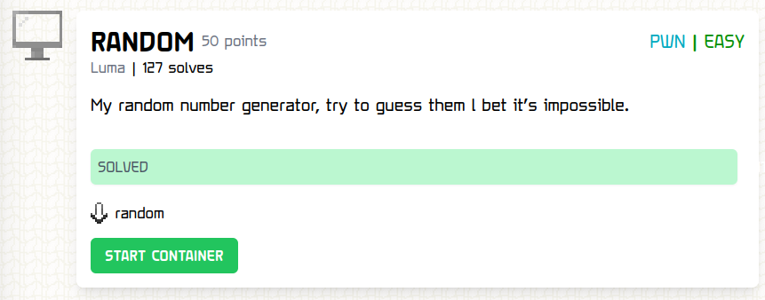

# RANDOM

### Challenge:
##### My random number generator, try to guess them l bet it’s impossible.
##### Files: [random](random)

### Solution:
We have a simple binary where we have to guess 10 randomly generated numbers in a row to get a shell.
The seed of the random generator is based on the current time so we can simply make a [script](solve.py) and get our flag.
```bash
$ python3 solve.py
[+] Opening connection to challs.tfcctf.com on port 32215: Done
[*] Switching to interactive mode
Guess my numbers!
$ ls
Dockerfile
code
flag.txt
$ cat flag.txt
TFCCTF{W0W!_Y0U_GU3SS3D_TH3M_4LL!@!}
```

Flag: ```TFCCTF{W0W!_Y0U_GU3SS3D_TH3M_4LL!@!}```
