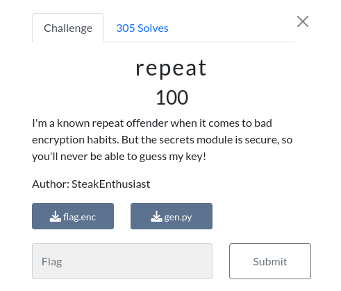

# repeat

### Challenge:
##### I'm a known repeat offender when it comes to bad encryption habits. But the secrets module is secure, so you'll never be able to guess my key!
##### Author: SteakEnthusiast

##### Files: [flag.enc](flag.enc), [gen.py](gen.py)

### Solution:

```py
import os
import secrets

flag = "REDACATED"
xor_key = secrets.token_bytes(8)

def xor(message, key):
    return bytes([message[i] ^ key[i % len(key)] for i in range(len(message))])

encrypted_flag = xor(flag.encode(), xor_key).hex()

with open("flag.enc", "w") as f:
    f.write("Flag: "+encrypted_flag)
```

Pretty simple challenge, the flag gets xor-ed with a 8 bytes long key, as we know the first 8 bytes of the flag (uoftctf{) we can recover the key and decode the flag

```py
from pwn import xor

flag = bytes.fromhex("982a9290d6d4bf88957586bbdcda8681de33c796c691bb9fde1a83d582c886988375838aead0e8c7dc2bc3d7cd97a4")

print(xor(flag, xor(flag, b"uoftctf{")[:8]))
#uoftctf{x0r_iz_r3v3rs1bl3_w17h_kn0wn_p141n73x7}
```

Solve script: [solve.py](solve.py)

Flag: ```uoftctf{x0r_iz_r3v3rs1bl3_w17h_kn0wn_p141n73x7}```