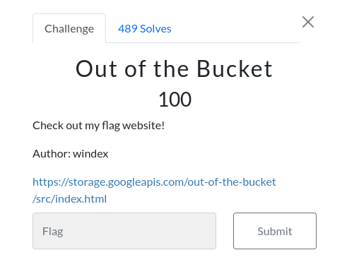

# Out of the Bucket 

### Challenge:
##### Check out my flag website!
##### Author: windex

##### Links: [https://storage.googleapis.com/out-of-the-bucket/src/index.html](https://storage.googleapis.com/out-of-the-bucket/src/index.html)

### Solution:

If we go to the root of /out-of-the-bucket we can find some pretty interesting links, in this first part of the challenge we can find ```secret/dont_show``` that contains the flag

```bash
$ curl https://storage.googleapis.com/out-of-the-bucket/secret/dont_show
uoftctf{allUsers_is_not_safe}
```

Flag: ```uoftctf{allUsers_is_not_safe}```