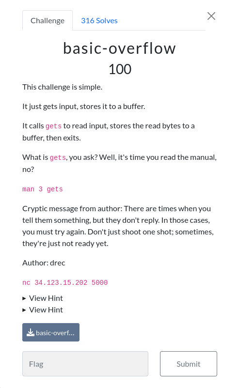

# basic-overflow 

### Challenge:
##### This challenge is simple.
##### It just gets input, stores it to a buffer.
##### It calls gets to read input, stores the read bytes to a buffer, then exits.
##### What is gets, you ask? Well, it's time you read the manual, no?
##### man 3 gets
##### Cryptic message from author: There are times when you tell them something, but they don't reply. In those cases, you must try again. Don't just shoot one shot; sometimes, they're just not ready yet.
##### Author: drec

##### Links: ```nc 34.123.15.202 5000```
##### Files: [basic-overflow](basic-overflow)

### Solution:

Gets() is an unsafe function, it doesn't perform any checks on the size of the input and gives us a buffer overflow.
We can use this bof to redirect execution to the shell() function:

```py
r.sendline(b"A"*72 + p64(exe.sym.shell))
```

64 characters to fill the buffer, 8 to fill the base pointer on the stack and the address of the shell() function to overwrite the return pointer.

Solve script: [solve.py](solve.py)

Flag: ```uoftctf{reading_manuals_is_very_fun}```