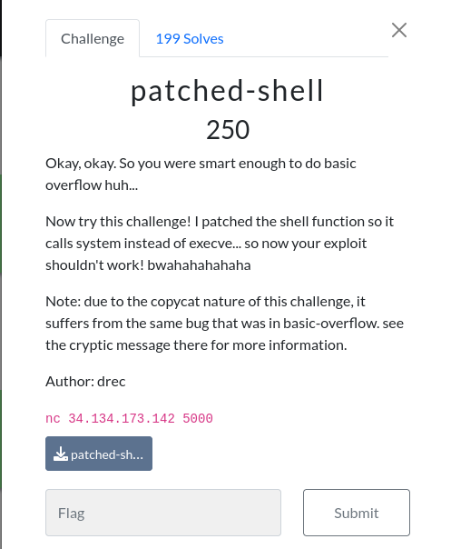

# patched-shell

### Challenge:
##### Okay, okay. So you were smart enough to do basic overflow huh...
##### Now try this challenge! I patched the shell function so it calls system instead of execve... so now your exploit shouldn't work! bwahahahahaha
##### Note: due to the copycat nature of this challenge, it suffers from the same bug that was in basic-overflow. see the cryptic message there for more information.
##### Author: drec

##### Links: ```nc 34.134.173.142 5000```
##### Files: [patched-shell](patched-shell)

### Solution:

Same challenge as the first one, however the in the shell() function system() is used instead of a syscall to execve, this doesn't change too much our exploit, however system() will fail if the stack isnt aligned to 16 bytes (aka if the address of rsp doesnt end with 0), we can simply fix this by jumping to ret first.

```py
r.sendline(b"A"*72 + p64(exe.sym.shell+21) + p64(exe.sym.shell)) #exe.sym.shell+21 -> RET
```

Solve script: [solve.py](solve.py)

Flag: ```uoftctf{patched_the_wrong_function}```