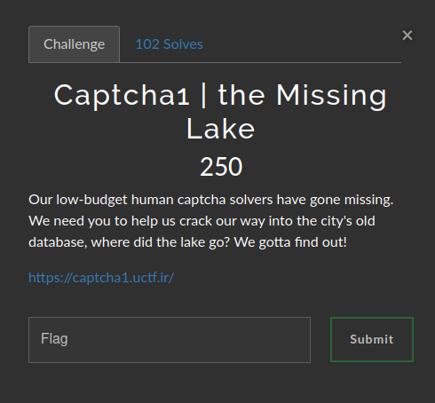

# Captcha1 | the Missing Lake

### Challenge:
##### Our low-budget human captcha solvers have gone missing. We need you to help us crack our way into the city's old database, where did the lake go? We gotta find out!

##### Link: [https://captcha1.uctf.ir/](https://captcha1.uctf.ir/)

### Solution:
We need to make a script to complete 300 captchas in order to get the flag.
I used the python library [pytesseract](https://pypi.org/project/pytesseract/) to read the text from the captchas.

After answering successfully to 300 captchas we can get our flag:
Flag: ```UCTF{7h3_m1551n6_l4k3}```

